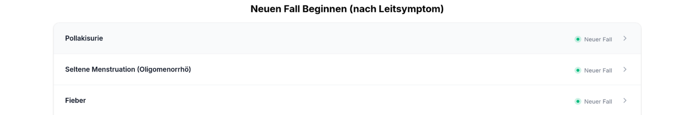
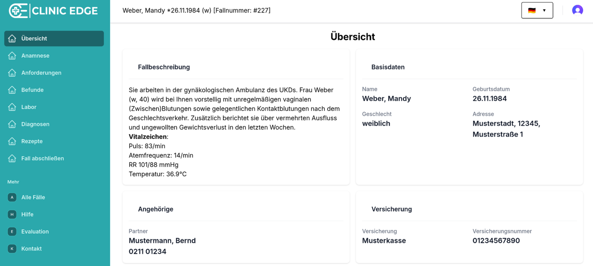
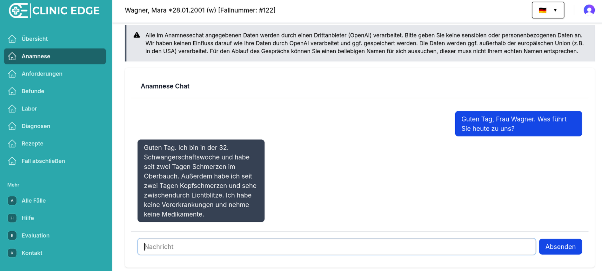
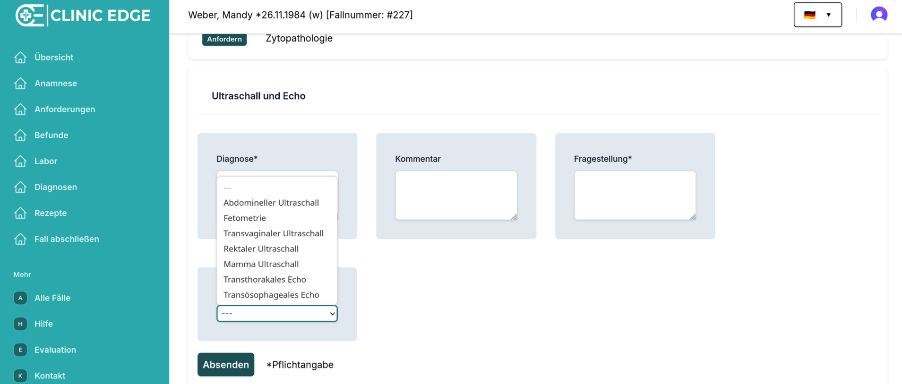
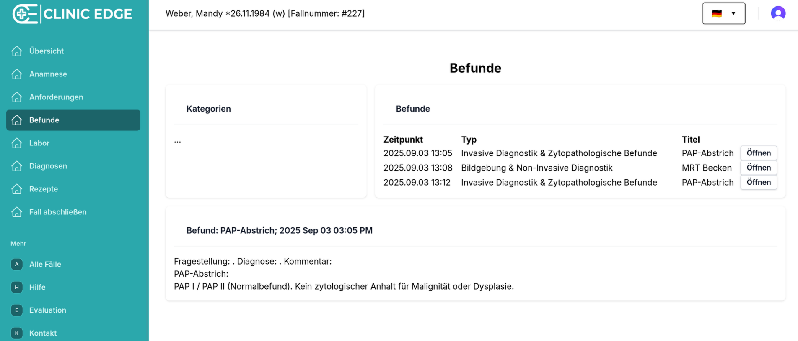
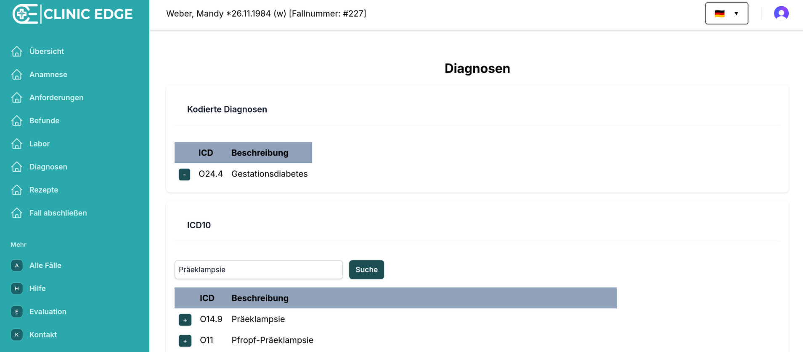
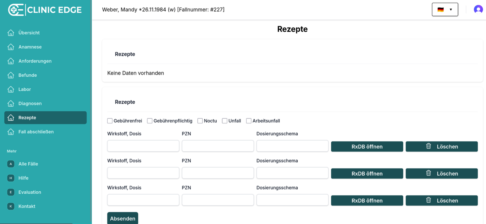
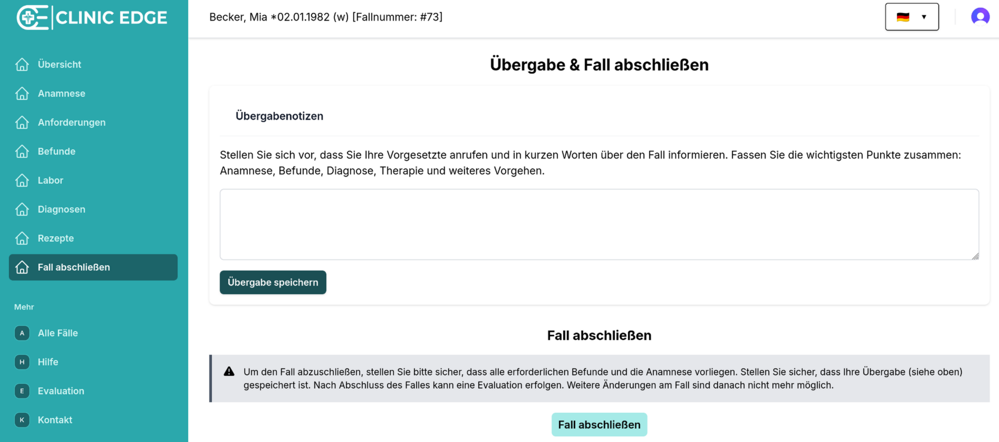
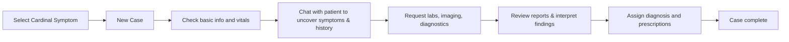

# 2.2 Key Functionalities

This chapter presents the key functionalities step by step — from case selection to diagnosis.

## 1. Case Selection

Users begin by selecting a **cardinal symptom** on the landing page (e.g., abdominal pain, fever, vaginal bleeding) to open and receive a new patient case.

## 2. Review the Case

Once a case is loaded, users can review:
- Basic information (e.g., age, sex)
- Vitals (e.g., temperature, heart rate)

## 3. Chat with the Patient

To investigate the patient’s symptoms and clinical history, users can use the **AI-powered patient chat** to explore:
- Current symptoms
- Medical history (e.g., pre-existing conditions, prior surgeries)  
- Menstrual history  

## 4. Request & Review Diagnostic Tests

Based on clinical interpreation, users can request relevant diagnostic tests and examinations, including:
- Lab tests (e.g., CRP, hemoglobin)  
- Microbiology and urinalysis (e.g., cultures, vaginal swabs)  
- Imaging (e.g., ultrasound, MRI, CT, X-ray)  
- Invasive diagnostics (e.g., laparoscopy, biopsy, hysteroscopy, cytopathology)

Each request returns auto-generated results, including:
- Lab values 
- Microbiology results  
- Written diagnostic reports for imaging and and other diagnostic procedures

## 5. Assign Diagnosis & Prescriptions

Once enough information has been gathered, users can:
- Assign **ICD-10 diagnoses**

- Add **prescriptions**

## 6. Finish Case

Users can hand over a summary of the case to a "supervisor". When everything is done, the case can be finished. Afterwards, no changes can be made anymore. 

## Summary 

