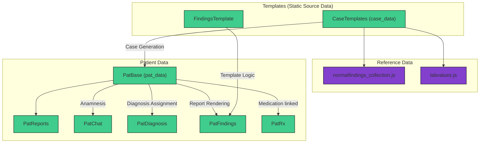

# 4. System Logic

The logic of Clinic Edge is based on processing of static template data into dynamic, patient-specific cases and diagnostic reports. This process relies on several data bases including Supabasa tables, internal reference files and internal logic scripts. The data flow consists of multiple steps and interactions.

### 4.1 Data Flow 

Step 1: Case Selection via Cardinal Symptoms
The user begins by selecting a cardinal symptom (e.g., `"abdominal_pain"`) or a specific case from the landing page. Then system then matches the selection by searching the `CaseTemplates` table. For symptom-based selection, it filters cases whose `case_data` contains the selected symptom in the `cardinal_symptoms` array.

Step 2: Template Retrieval from `CaseTemplates`
Once a matching case is selected, its corresponding template is retrieved from `case_data` in the `CaseTemplates` table. See [**Section 3.2.2 Case Templates**](Database_Structure/3_2_2_case_templates.md) for more details.

Step 3: Generation of `pat_data` → `PatBase`
Using the selected `case_data`, the system dynamically generates a new patient case. Lab values, vitals, and findings are randomized within predefined ranges.
If "normal" is defined or fields are left empty, data is injected from `normalfindings_collection.json` and `labvalues.json`. All probabilistic logic is handled via the internal logic files `logic.js`. The generated patient case is stored in `PatBase` and assigned a unique `pat_id`.

Step 4: Diagnostic Requests → `PatFindings`
When the user requests an examination (e.g., "transvaginal ultrasound"), the system performs the following:
1. Fetches the relevant data from `pat_data` in `PatBase`.
2. Selects the corresponding template in `FindingsTemplate`.
3. Generates and injects measurements via `vars`.
4. Generates and injects written descriptions of abnormal findings and pathologies via `vars_path`.
5. Assembles a complete, case-specific written report.

The rendered report is then stored in the `PatFindings` table.