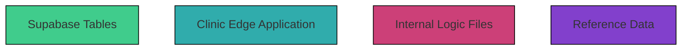

### 6.2 Color Coding for Mermaid Diagrams

Mermaid diagrams follow a standardized color coding scheme in the Clinic Edge documentation. This scheme improves visualization of system components such as Supabase tables, internal logic files, static reference data, and dynamically generated patient data.



### Fill Colors

Fill colors help to distinguish where each component is defined or located:

| Category                  | Description                                                                                 | Fill Color       |
|---------------------------|---------------------------------------------------------------------------------------------|------------------|
| Supabase Tables     | All data stored in Supabase (e.g., `CaseTemplates`, `FindingsTemplate`, `PatBase`, etc.)    | `#40cc8c` ( green) |
| Clinic Edge Application | UI components and user interactions (e.g., case selection, findings requests, chat, etc.)   | `#30acac` (turquoise)  |
| Internal Logic Files   | Files for data processing and logic (e.g., `logic.js`, `logic_server.js`, `requests.js`)   | `#fbeec1` (pink)|
| Reference Data         | Static reference data (e.g., `normalfindings_collection.js`, `labvalues.js`)               | `#f0f0f0` (purple) |

### Mermaid Class Definitions

Paste this at the end of each Mermaid diagram to define the color coding scheme above:

```
classDef supabase fill:#40cc8c,stroke:#000000,stroke-width:1px;
classDef UI fill:#30acac,stroke:#000000,stroke-width:1px;
classDef logic fill:#cc4078,stroke:#000000,stroke-width:1px;
classDef reference fill:#8240cc,stroke:#000000,stroke-width:1px;
```

### Applying Classes in Mermaid

Assign the appropriate class to each node by using the `:::` syntax like this:

```
A["Supabase Tables"]:::supabase
B["Clinic Edge Application"]:::UI
C["Internal Logic Files"]:::logic
D["Reference Data"]:::reference
```

### Border Styles

Border styles help to distinguish between static and dynamic content. Border styles need to be defined manually for each node. 

| Category           | Description                                                                 | Border Style |
|--------------------|-----------------------------------------------------------------------------|--------------|
| Static Data     | Files or values that remain unchanged (e.g., templates, reference data)     | `solid`      |
| Dynamic Data    | Data generated dynamically upon user action or request (e.g., `pat_data`)   | `dashed`     |