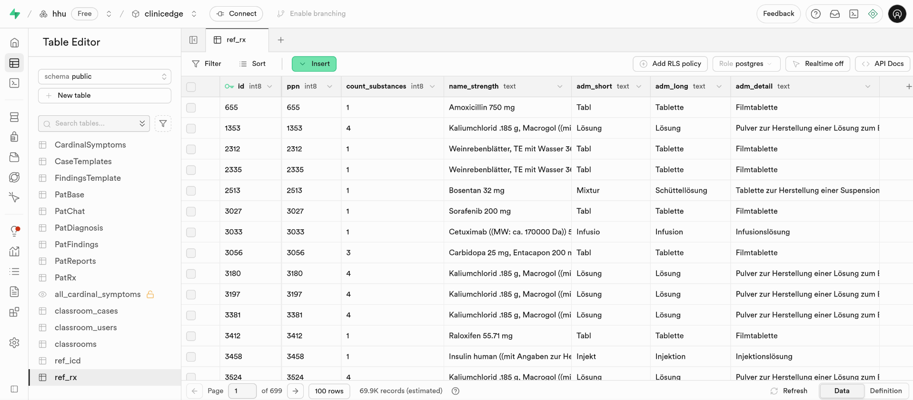
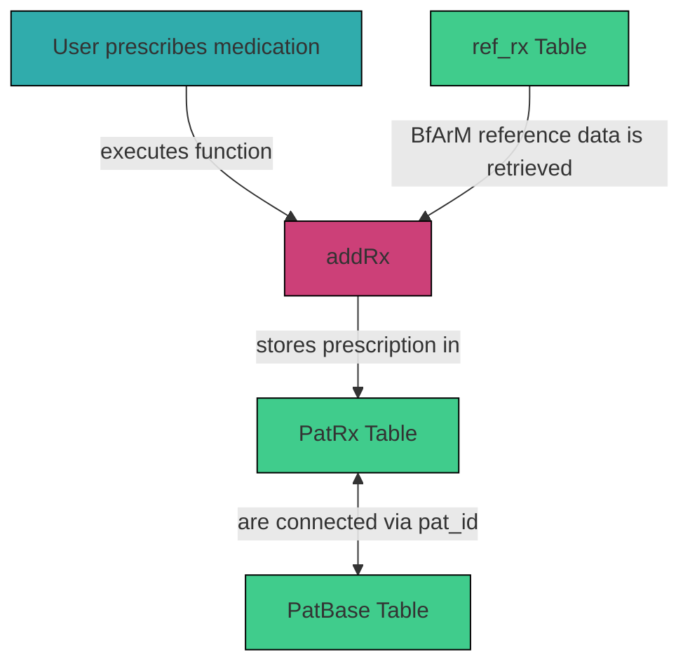

# 3.2.10 `ref_rx`

The `ref_rx` table in supabase stores the BfArM reference data for pharmacy products and is referenced when patients are prescribed medications.

## Table Structure

| Column            | Format  | Type   | Description                                                               |
|-------------------|---------|--------|---------------------------------------------------------------------------|
| `id`              | bigint  | number | Unique identifier for each substance and is equal to the PPN              |
| `ppn`             | bigint  | number | Pharmacy Product Number (PPN) of each substance                           |
| `count_substances`| bigint  | number |                                                                           |
| `name_strength`   | text    | string | Name and strength of the medication                                       |
| `adm_short`       | text    | string | Abbreviation of the dosage form                                           |
| `adm_long`        | text    | string | Dosage form (e.g., tablet)                                                |
| `adm_detail`      | text    | string | Specification of the dosage form (e.g., film-coated tablet)               |

## Integration within the System

