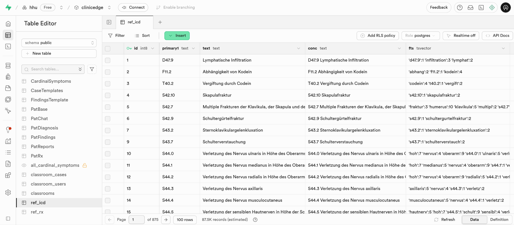
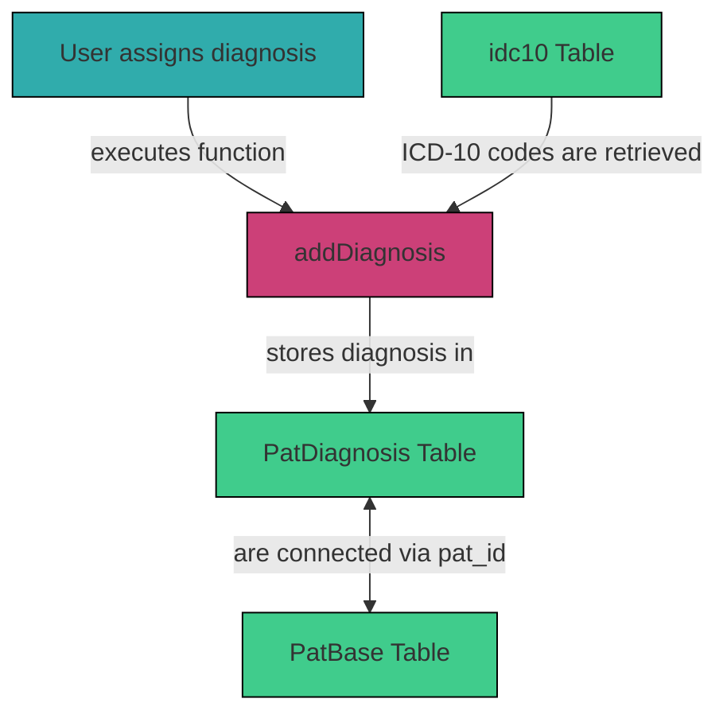

# 3.2.11 `icd10` 

The `icd10` table in supabase stores the ICD-10 diagnosis codes and is referenced when a user assigns a diagnosis to a patient case.

## Table Structure

| Column        | Format  | Type   | Description                                                               |
|---------------|---------|--------|---------------------------------------------------------------------------|
| `id`          | bigint  | number | Internal ID of each ICD-10 diagnosis code                               |
| `type`        | bigint  | number |                                         |
| `print`       | bool    | boolean|           |
| `primary1`    | text    | string | ICD-10 diagnosis code           |
| `star`        | text    | string |           |
| `additional`  | text    | string |           |
| `primary2`    | text    | string |           |
| `text`        | text    | string | Description of the diagnosis          |
| `fts`         | tsvector| tsvector| Contains data to optimize text search         |
| `conc`        | text    | string | `primary1` (ICD-10 code) concatenated with `text` (description of the diagnosis) |

## Integration within the System

