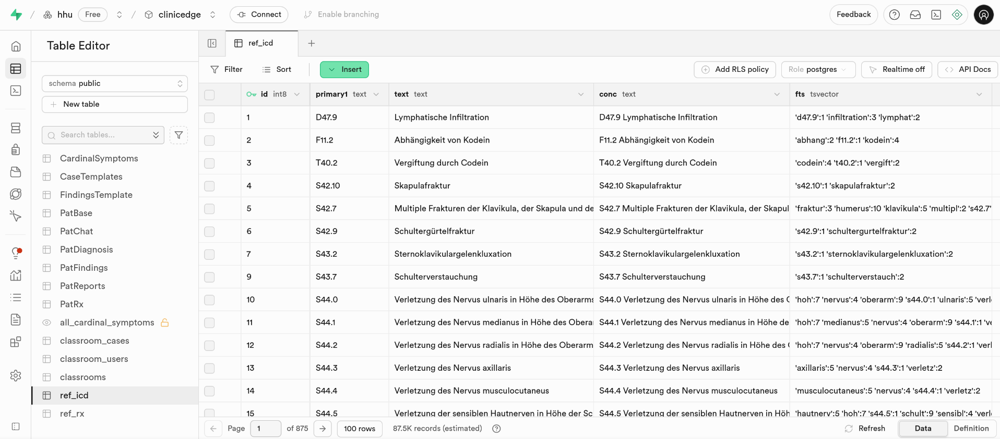
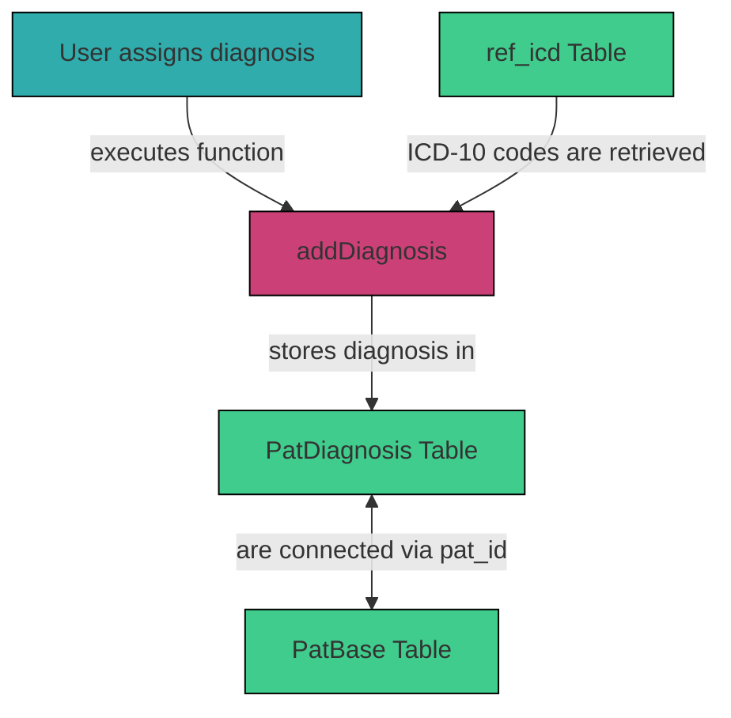

# 3.2.11 `ref_icd` 

The `ref_icd` table in supabase stores the ICD-10 diagnosis codes and is referenced when a user assigns a diagnosis to a patient case.

## Table Structure

| Column        | Format  | Type   | Description                                                               |
|---------------|---------|--------|---------------------------------------------------------------------------|
| `id`          | bigint  | number | Internal ID of each ICD-10 diagnosis code                                 |
| `primary1`    | text    | string | ICD-10 diagnosis code                                                     |
| `text`        | text    | string | Description of the diagnosis                                              |
| `conc`        | text    | string | `primary1` (ICD-10 code) concatenated with `text` (description of the diagnosis) |
| `fts`         | tsvector| tsvector| Contains data to optimize text search                                    |

## Integration within the System

