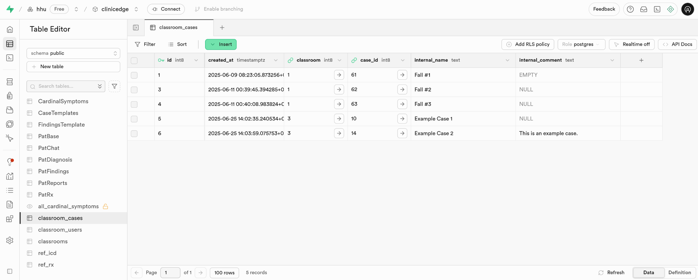
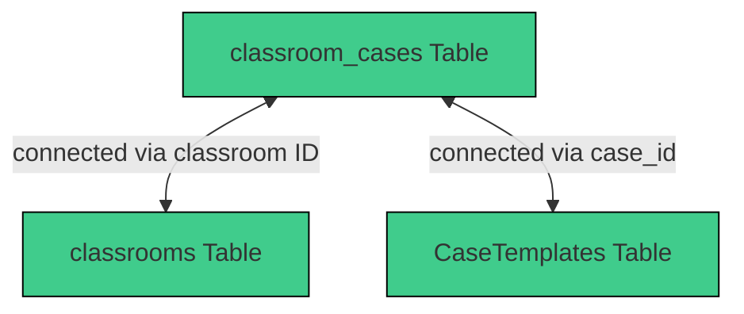

# 3.2.12 `classroom_cases`

## Table Structure

| Column        | Format  | Type   | Description                                                               |
|---------------|---------|--------|---------------------------------------------------------------------------|
| `id`          | bigint  | number | Internal ID for each classroom case                               |
| `classroom`   | bigint  | number | Contains IDs of the assigned `classrooms`                             |
| `case_id`     | bigint  | number | Contains references to the associated case data in `CaseTemplates`         |
| `internal_name`| text   | string | Name of each case          |

## Integration within the System

