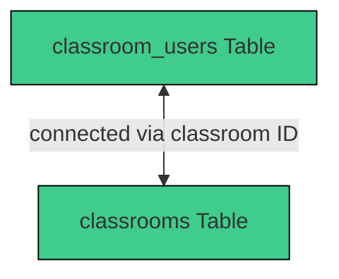

# 3.2.13 `classroom_users`

The `classroom_users` table in Supabase stores the IDs of users assigned to a classroom.

## Table Structure

| Column        | Format  | Type   | Description                                                               |
|---------------|---------|--------|---------------------------------------------------------------------------|
| `id`          | bigint  | number | Internal ID for each classroom user                                       |
| `classroom`   | bigint  | number | Contains IDs of the assigned classrooms                                   |
| `userid`      | text    | string | ID of each user                                                           |

## Integration within the System

