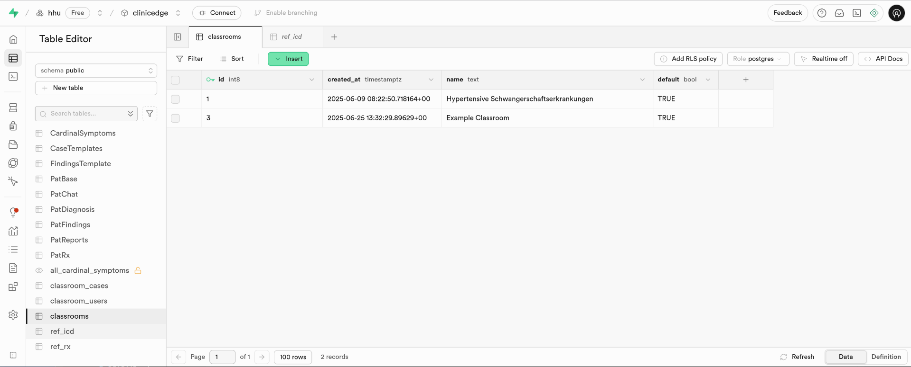

# 3.2.14 `classrooms`

The `classrooms` table in Supabase stores the created classrooms, to which several cases can be assigned. To learn how to create a new classroom, see [**Section 5.4 How to Create a Classroom**](../Tutorials/5_4_tutorial_classroom.md).

## Table Structure

| Column        | Format  | Type   | Description                                                               |
|---------------|---------|--------|---------------------------------------------------------------------------|
| `id`          | bigint  | number | Internal ID for each created classroom                                    |
| `name`        | text    | string |  Name of each classroom                                                   |
| `default`     | bool    | boolean| `TRUE`, if classroom is active and should be shown in the case overview; `FALSE`, if classroom is inactive |
| `mode`        | text    | string| `rnd`, if cases should be selected randomly; `NULL`, if cases are selected by the creator of the classroom |

## Integration within the System

