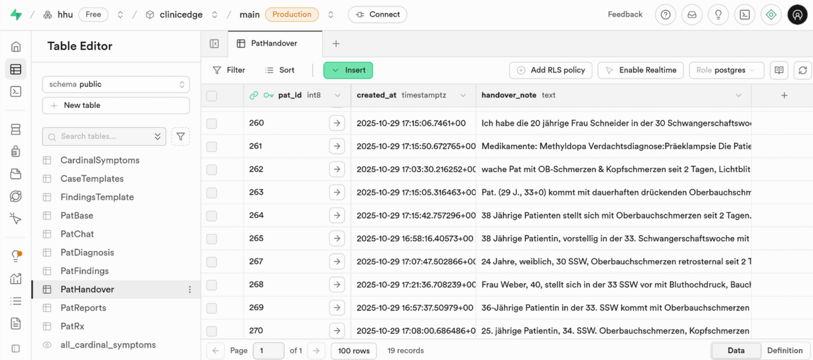
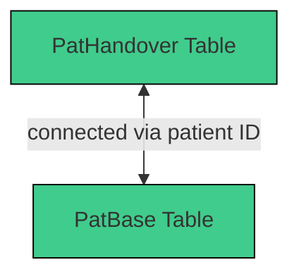

# 3.2.15 `PatHandover` 

The `PatHandover` table contains all handover notes written by users. Each handover note is linked to the corresponding patient via `pat_id`.

| Column          | Format | Type   | Description                                                                 |
|-----------------|--------|--------|-----------------------------------------------------------------------------|
| `pat_id`        | bigint | number | Refers to the corresponding patient in `PatBase`                            |
| `handover_note` | text   | string | Handover note created by the user                                           |

## Integration within the System

