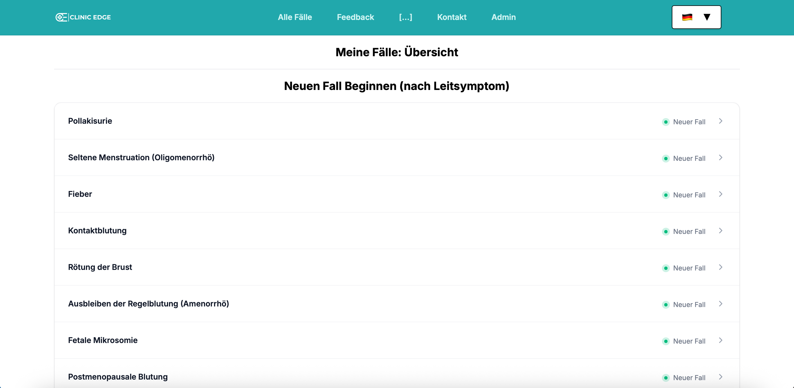
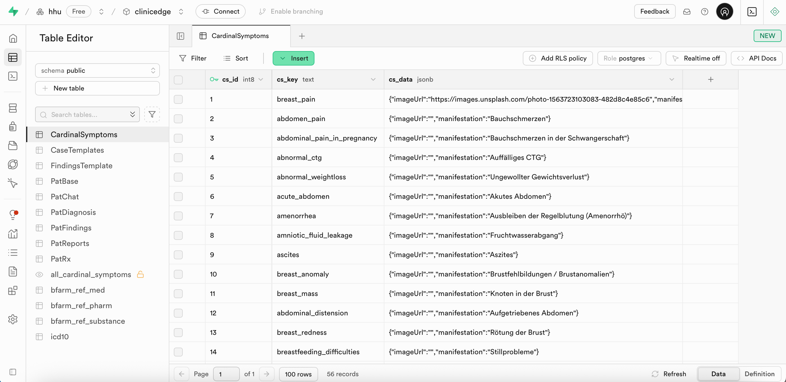
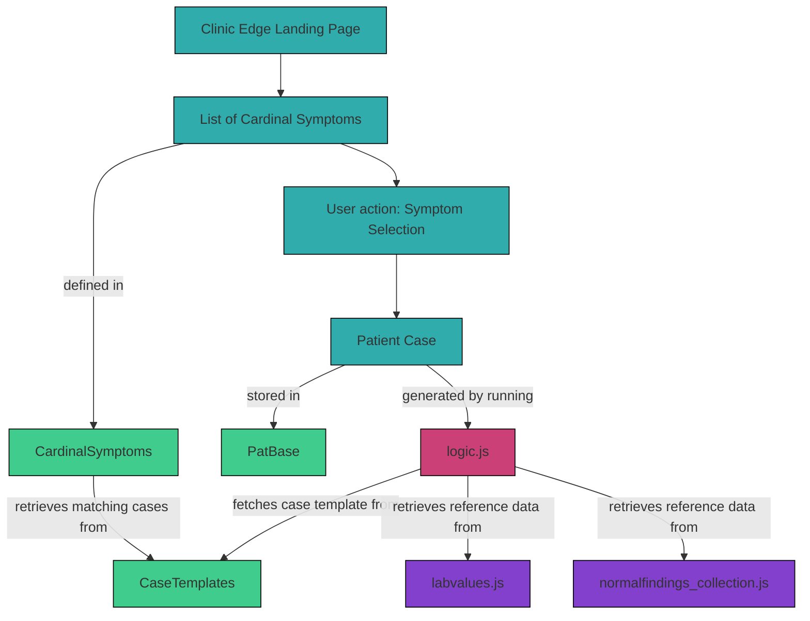

#### 3.2.1 `CardinalSymptoms`

The `CardinalSymptoms` table in Supabase defines a reference list of common cardinal symptoms in gynecological and obstetrics diagnoses. It serves as a symptom dictionary that allows diagnoses to be grouped based on shared clinical manifestations. 

These cardinal symptoms are displayed on the Clinic Edge landing page, where users can select a symptom to receive a randomly generated patient case linked to that symptom. 



### Table Structure

The Clinic Edge landing page is built upon the `CardinalSymptoms` table in Supabase, which stores the underlying data to display the list of symptoms. This table stores metadata for each cardinal symptom, including a display title (`manifestation`) and an optional image, both defined in the `cs_data` JSON field. 

The structure of the table is as follows:

| Column     | Format | Type   | Description                                                              |
|------------|--------|--------|--------------------------------------------------------------------------|
| `cs_id`    | bigint | number | Internal ID for each cardinal symptom                                    |
| `cs_key`   | text   | string | Identifier for each cardinal symptom (e.g., `"breast_pain"`)             |
| `cs_data`  | jsonb  | json   | JSON object containing display metadata, such as title and optional image|



### Integration with CaseTemplates

Each case in Clinic Edge is defined as a JSON object located in the `CaseTemplates` table in Supabase. For each case, cardinal symptoms are defined in the `cardinal_symptoms` array inside their `case_data`. This allows each symptom to be associated with multiple diagnoses and vice versa.

For example, a case like `adnexitis` can be linked to a set of cardinal symptoms (e.g., abdominal pain, fever), while the same cardinal symptoms also appear across other diagnoses.

Example from the `case_data` for `adnexitis`:
```json
"cardinal_symptoms": [
    "abdominal_pain",
    "fever",
    "acute_abdomen",
    "menstrual_disorder"
]
```
### Data Flow

When a user selects a cardinal symptom on the landing page, Clinic Edge:
1. Searches all cases within the `CaseTemplates` table that are associated with this cardinal symptom
2. Randomly selects one case
3. Generates a realistic patient case using predefined parameters and probabilistic variation

The flow diagram below shows how the `CardinalSymptoms` table is connected to the case data:



The graph below shows how cardinal symptoms can be mapped to multiple cases:

```mermaid
graph LR
  subgraph Cardinal Symptoms
    CS_abdominal_pain["abdominal_pain"]
    CS_fever["fever"]
    CS_menstrual_disorder["menstrual_disorder"]
    CS_genital_discharge["genital_discharge"]
  end

  subgraph Cases
    D_adnexitis["adnexitis"]
    D_ectopic_pregnancy["ectopic pregnancy"]
    D_borderline_tumor["borderline tumor"]
    D_ovarian_cyst["ovarian cyst"]
    D_miscarriage["miscarriage"]
    D_placental_abruption["placental abruption"]
    D_mastitis["mastitis"]
    D_puerperal_fever["puerperal fever"]
    D_uti["urinary tract infection (UTI)"]
    D_endometriosis["endometriosis"]
    D_follicle_cyst["follicle cyst"]
    D_iud["IUD"]
    D_pcos["PCOS"]
    D_bacterial_vaginosis["bacterial vaginosis"]
    D_cervical_cancer["cervical cancer"]
    D_trichomoniasis["trichomoniasis"]
    D_vulvovaginal_candidiasis["vulvovaginal candidiasis"]
  end

  CS_abdominal_pain --> D_adnexitis
  CS_abdominal_pain --> D_ectopic_pregnancy
  CS_abdominal_pain --> D_borderline_tumor
  CS_abdominal_pain --> D_ovarian_cyst
  CS_abdominal_pain --> D_miscarriage
  CS_abdominal_pain --> D_placental_abruption

  CS_fever --> D_adnexitis
  CS_fever --> D_mastitis
  CS_fever --> D_puerperal_fever
  CS_fever --> D_uti

  CS_menstrual_disorder --> D_adnexitis
  CS_menstrual_disorder --> D_endometriosis
  CS_menstrual_disorder --> D_follicle_cyst
  CS_menstrual_disorder --> D_iud
  CS_menstrual_disorder --> D_pcos
  CS_menstrual_disorder --> D_ovarian_cyst

  CS_genital_discharge --> D_bacterial_vaginosis
  CS_genital_discharge --> D_cervical_cancer
  CS_genital_discharge --> D_trichomoniasis
  CS_genital_discharge --> D_vulvovaginal_candidiasis
 ```
