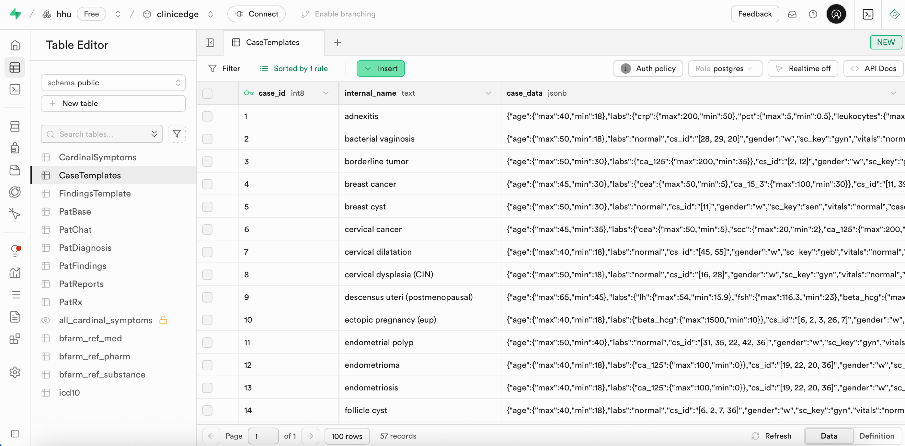
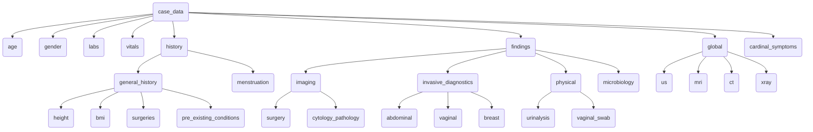

# 3.2.2 `CaseTemplates`

The `CaseTemplates` table contains the diagnostic templates used to generate patient cases. Each row represents a diagnosis, with `case_data` encoded as a JSON object that includes case-specific findings and case-specific such as expected lab values, findings, symptoms, and clinical history. Templates are static and remain unchanged. Randomization are applied at the point of patient case generation. 

The table supports two types of cases:
1. **Dynamic cases** are based on predefined probabilistic values and findings, that are generated randomly, when a user accesses a new patient case.
2. **Static cases** are based on fixed values and reports, typically representing one specific presentation of a diagnosis. 

## Table Structure

| Column        | Format  | Type   | Description                                                               |
|---------------|---------|--------|---------------------------------------------------------------------------|
| `case_id`     | bigint  | number | Internal ID for each case template                                        |
| `case_key`    | text    | string | Identifier for each case (e.g., `"adnexitis"`, `"ectopic_pregnancy"`)     |
| `case_data`   | jsonb   | json   | JSON object containing all case-specific parameters                       |



## Case Data Structure (applies to all cases)

The `case_data` field in `CaseTemplates` is a nested JSON object that contains patient demographics, findings, history, vitals, and other parameters and values. Hierarchy and categories are the same for both dynamic and static cases.

Here is a simplified structure overview:
```
`case_data`
├── case_id
├── internal_name
├── sc_key
├── cs_id
├── cardinal_symptoms
├── age
├── gender
├── labs
├── findings
│   ├── global
│   ├── imaging
│   │   ├── us
│   │   ├── mri
│   │   ├── ct
│   │   └── xray
│   ├── invasive_diagnostics
│   │   ├── surgery
│   │   └── cytology_pathology
│   ├── physical
│   │   ├── abdominal
│   │   ├── vaginal
│   │   └── breast
│   ├── microbiology
│   │   ├── urinalysis
│   │   └── vaginal_swab
├── vitals
├── history
│   ├── general_history
│   │   ├── height
│   │   ├── bmi
│   │   ├── surgeries
│   │   └── pre_existing_conditions
│   └── menstruation
```


### Dynamic Cases

Dynamic case files are stored as separate JSON files, and transferred into a single csv table using a python script to then import the csv into Supabase.

#### Dynamic Case Data

- Example diagnosis: **Adnexitis**
- Contains expected ranges and probabilities for:
  - `age`: min/max
  - `gender`
  - `labs`: min/max or fixed ranges (with optional gender/age stratification)
  - `vitals`: probabilities for fever, tachypnea, etc.
  - `findings`: imaging, surgery, physical exam, microbiology, etc.
  - `history`: pre-existing conditions, surgeries, menstrual cycle, etc. 
  - `cardinal_symptoms`: key symptoms like fever, abdominal pain, etc.

Each case is assigned a `case_id` (e.g., `1 = adnexitis`). Data under findings need to follow the same structure as in `src/utils/logic/requests.js` e.g. "imaging" -> "us" -> "us_tv". 

Example Data:
```json
{
  "age": {
    "max": 45,
    "min": 25
  },
  "labs": {
    "crp": {
      "max": 15,
      "min": 2
    },
    "pct": {
      "max": 0.5,
      "min": 2
    },
    "leukocytes": {
      "max": 20,
      "min": 14
    }
  },
  "gender": [
    "w"
  ],
  "vitals": {
    "fever": 0.5,
    "tachypnea": 0.4,
    "hypotension": 0.1,
    "tachycardia": 0.4
  },
  "history": {
    "bmi": {
      "max": 17,
      "min": 29
    },
    "height": {
      "max": 180,
      "min": 150
    },
    "period": {
      "heavy": 0.1,
      "irregular": 0.1,
      "dysmenorrhea": 0.1
    },
    "surgeries": {
      "appendectomy": 0.4,
      "cesarean_section": 0.1
    },
    "contraception": {
      "iud": 0.1,
      "hormonal": 0.4
    },
    "last_menstrual_period": {
      "max": 14,
      "min": 7
    },
    "pre_existing_conditions": {
      "endometriosis": 0.1
    }
  },
  "findings": {
    "imaging": {
      "us": {
        "us_tv": {
          "common": {
            "free_fluid": 0.8
          },
          "ovary_l": {
            "hydrosalpinx": 1,
            "tuboovarian_abscess": 1
          },
          "ovary_r": {
            "hydrosalpinx": 0.1,
            "tuboovarian_abscess": 0.8
          }
        }
      }
    },
    "surgery": {
      "hsk": {
        "inflammation": 0.9
      },
      "lsk": {
        "adhesions": 0.5,
        "inflammation": 0.9,
        "tuboovarian_abscess": 0.2
      }
    },
    "physical": {
      "vaginal": {
        "palpation": {
          "pelvic_pain": 0.8,
          "adnexal_tenderness": 0.8,
          "cervical_motion_tenderness": 0.95
        },
        "speculum": {
          "purulent_discharge": 0.6
        }
      },
      "abdominal": {
        "palpation": {
          "guarding": 0.8,
          "abdominal_pain": 0.8,
          "abdominal_tension": 0.6
        }
      }
    },
    "microbiology": {
      "vaginal_swab": {
        "pathogens": {
          "Chlamydia trachomatis": 0.5,
          "Neisseria gonorrhoeae": 0.5,
          "Polymicrobial infection": 0.5
        }
      }
    }
  },
  "cardinal_symptoms": [
    "abdominal_pain",
    "fever",
    "acute_abdomen"
  ]
}
```

### Static Cases

Static cases can be created to specify values and reports deterministically. This can for example be useful, if you want to include an anonymized real medical case. The data of static cases is also stored in `CaseTemplates` and follows a similar structure as in dynamic cases. The main difference to dynamic cases lies in the additional keys `static_value` and `static_report`. 

#### How to use `static_value`and `static_report`

`static_value` is used to set specific values without declaring a range or probabilities. This can be applied to numerical values and strings, including arrays of strings. Examples are shown below.

```json
{ "age": {
    "static_value": 38
  },
  "labs": {
    "cea": {
      "static_value": 12
    },
    "scc": {
      "static_value": 9
    },
    "ca_125": {
      "static_value": 130
    }
  },
  "gender": "w",
  "history": {
    "menstruation": {
      "cycle_length": {
        "static_value": "25-28_days"
      },
      "menstrual_duration": {
        "static_value": "6_days"
      }
    },
    "general_history": {
      "bmi": {
        "static_value": 20
      },
      "height": {
        "static_value": 170
      },
      "surgeries": {
        "static_value": "appendectomy"
      },
      "pre_existing_conditions": {
        "static_value": [
          "nicotine_abuse",
          "hpv_infection"
        ]
      }
    }
  }
}
```

`static_report` can be used to specify a report as a complete text. Images (e.g. ultrasound images) can be included, but are not necessarily needed. An example of what it can look like is shown in the following.

```json
{ "findings": {
    "imaging": {
      "us": {
        "us_tv": {
          "static_report": {
            "text": "Here, you can write your report about the associated images.",
            "images": [
              "https://files.clinic-edge.org/images/tvus/example_image.jpg"
            ]
          }
        }
      }
    }
  }
}
```

Another option is to only write reports about specific organs as shown below. The other organs, that aren't described here, will be treated as `normal`.

```json
{ "findings": {
    "imaging": {
      "us": {
        "us_tv": {
          "cervix": {
            "static_report": {
              "text": "Here, you can write your report about the cervix."
            } 
          }, 
          "ovary_r": {
            "static_report": {
              "text": "Here, you can write your report about the right ovary."
            }
          }
        }
      }
    }
  }
}
```

Normal values as well as normal findings do not have to be specified. They will be inserted as described in [**Section 3.2.3 `FindingsTemplate`**](./3_2_3_findings_template.md).

##  How to Create a New Case

To learn how to create your own static or dynamic case template, see the step-by-step guide in [**Section 5.1 How to Create a New Case**](../Tutorials/5_1_tutorial_case.md).
