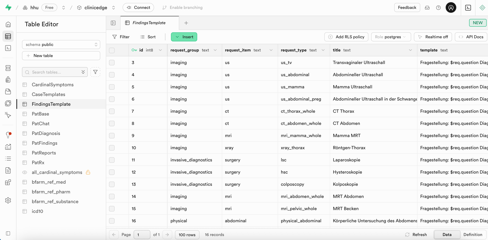
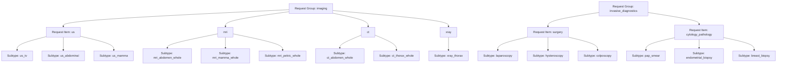

# 3.2.3 `FindingsTemplate`

The `FindingsTemplate` table enables automated rendering of written medical reports for each diagnostic method (e.g., ultrasound, physical exam, surgery). Each `request_type` defines how a specific finding in `pat_data`, rendered based on the probabilities in `case_data`, should be reported, when the user requests a diagnostic method.

### Table Structure

| Column          | Format | Type   | Description                                                                 |
|-----------------|--------|--------|-----------------------------------------------------------------------------|
| `id`            | bigint | number | ?                                                                           |
| `request_group` | text   | string | Diagnostic group (e.g., `imaging`, `physical`, `microbiology`)              |
| `request_item`  | text   | string | Diagnostic modality or item type (e.g., `us`, `mri`)                        |
| `request_type`  | text   | string | Specific examination subtype (e.g., `us_tv`, `mri_abdomen`)                 |
| `title`         | text   | string | Title of the Finding Report                                                 |
| `template`      | text   | string |                                                                             |     
| `vars`          | jsonb  | json   |                                                                             |  
| `vars_path`     | jsonb  | json   |                                                                             |  





Example `template` from `mri_pelvic_whole`:
```
Fragestellung: $req.question
Diagnose: $req.diagnosis
Kommentar: $req.comment

Uterus:
$findings.uterus.position 
$findings.uterus.height cm x $findings.uterus.width cm x $findings.uterus.depth cm
$findings.uterus.description
$findings.uterus.pathology

Endometrium:
$findings.endometrium.thickness mm
$findings.endometrium.description
$findings.endometrium.pathology

Zervix:
$findings.cervix.description
$findings.cervix.pathology

Ovar links:
$findings.ovary_l.height cm x $findings.ovary_l.width cm
$findings.ovary_l.description
$findings.ovary_l.pathology

Ovar rechts:
$findings.ovary_r.height cm x $findings.ovary_l.width cm
$findings.ovary_r.description
$findings.ovary_r.pathology

Douglas-Raum:
$findings.douglas.description
$findings.douglas.pathology

Harnblase:
$findings.bladder.description
$findings.bladder.pathology

Darm:
$findings.bowel.description
$findings.bowel.pathology

Lymphknoten:
$findings.lymph_nodes.description
$findings.lymph_nodes.pathology

Gefäße:
$findings.vessels.description
$findings.vessels.pathology

Skelett:
$findings.skeleton.description
$findings.skeleton.pathology

Allgemein:
Gute Bildqualität ohne Bewegungsartefakte
$findings.common.pathology
```

The template serves as a text template. Values and written findings descriptions are injected dynamically during case rendering.

**vars**: defines quantitative and qualitative variables for randomization under `$findings` e.g.

Example `vars` from `mri_pelvic_whole`:
```json
{
  "bowel": {
    "description": {
      "normal": {
        "text": "Darmabschnitte in normaler Weite und Wanddicke, kein Hinweis auf Ileus oder entzündliche Prozesse."
      }
    }
  },
  "cervix": {
    "description": {
      "normal": {
        "text": "Zervix regelrecht konfiguriert, kein Hinweis auf Stenose."
      }
    }
  },
  "uterus": {
    "depth": {
      "normal": {
        "max": 8,
        "min": 6.5
      },
      "uterine_enlargement": {
        "max": 12,
        "min": 8.5
      }
    },
    "width": {
      "normal": {
        "max": 5,
        "min": 4
      },
      "uterine_enlargement": {
        "max": 8,
        "min": 5.5
      }
    },
    "height": {
      "normal": {
        "max": 4.5,
        "min": 3
      },
      "uterine_enlargement": {
        "max": 7,
        "min": 5
      }
    },
    "position": {
      "normal": {
        "av/af": 0.9,
        "retro": 0.1,
        "singular": true
      },
      "uterine_retroversion": {
        "av/af": 0,
        "retro": 1,
        "singular": true
      }
    },
    "description": {
      "normal": {
        "text": "Uterus regelrecht konfiguriert mit homogenem Myometrium ohne fokalen Läsionen."
      }
    }
  },
  "bladder": {
    "description": {
      "normal": "Harnblase glattwandig mit normaler Wanddicke."
    }
  },
  "douglas": {
    "description": {
      "normal": {
        "text": "Douglas-Raum frei, kein Nachweis freier Flüssigkeit."
      }
    }
  },
  "ovary_l": {
    "width": {
      "normal": {
        "max": 3,
        "min": 1.5
      },
      "postmenopausal_ovaries": {
        "max": 1.5,
        "min": 0.5
      }
    },
    "height": {
      "normal": {
        "max": 2.5,
        "min": 1
      },
      "postmenopausal_ovaries": {
        "max": 1.5,
        "min": 0.5
      }
    },
    "description": {
      "normal": {
        "text": "Linkes Ovar in regelrechter Größe mit peripheren Follikeln und homogener Signalstruktur."
      },
      "postmenopausal_ovaries": {
        "text": "Linkes Ovar entsprechend eines postmenopausalen Normalbefundes atroph, klein und homogen ohne erkennbare Follikelstrukturen."
      }
    }
  },
  "ovary_r": {
    "width": {
      "normal": {
        "max": 3,
        "min": 1.5
      },
      "postmenopausal_ovaries": {
        "max": 1.5,
        "min": 0.5
      }
    },
    "height": {
      "normal": {
        "max": 2.5,
        "min": 1
      },
      "postmenopausal_ovaries": {
        "max": 1.5,
        "min": 0.5
      }
    },
    "description": {
      "normal": {
        "text": "Rechtes Ovar in regelrechter Größe mit peripheren Follikeln und homogener Signalstruktur."
      },
      "postmenopausal_ovaries": {
        "text": "Rechtes Ovar entsprechend eines postmenopausalen Normalbefundes atroph, klein und homogen ohne erkennbare Follikelstrukturen."
      }
    }
  },
  "vessels": {
    "description": {
      "normal": {
        "text": "Pelvine Gefäße ohne Nachweis von Stenosen, Aneurysma oder Dissektion."
      }
    }
  },
  "skeleton": {
    "description": {
      "normal": {
        "text": "Sichtbare knöcherne Strukturen ohne fokale Signalveränderungen."
      }
    }
  },
  "endometrium": {
    "thickness": {
      "normal": {
        "max": 12,
        "min": 5
      },
      "description": {
        "normal": {
          "text": "Endometrium zyklusadaptiert homogen aufgebaut."
        },
        "postmenopausal_endometrium": {
          "text": "Endometrium entsprechend eines postmenopausalen Normalbefundes atroph, dünn und homogen."
        }
      },
      "postmenopausal_endometrium": {
        "max": 4,
        "min": 1
      }
    }
  },
  "lymph_nodes": {
    "description": {
      "normal": {
        "text": "Keine pathologisch vergrößerten oder signalveränderten pelvinen Lymphknoten."
      }
    }
  }
}
```

- Quantitative values (min, max) → generated randomly from a range
- Categorical values (position) → picked based on defined probability
- singular: true → ensures only one value is selected (e.g., one uterus position)

**vars_path**: generates textual descriptions for pathological findings from `pat_data` e.g.:

Example `vars_path` from `mri_pelvic_whole`:
```json
{
  "bowel": {
    "rectocele": "",
    "colon_endometriosis": "Infiltrative, signalalterierte Läsionen an Rektum und Sigma, vereinbar mit kolorektalen Endometrioseherden.",
    "colon_wall_thickening": "Segmentale Wandverdickung des Kolons, vereinbar mit entzündlicher Genese."
  },
  "cervix": {
    "cervical_mass": "Zervikale Raumforderung unklarer Genese.",
    "cervical_dilatation": "Zervikalkanal erweitert.",
    "cervical_shortening": "Zervixlänge verkürzt."
  },
  "common": {
    "endometriosis": "Nachweis von multiplen Endometriose-verdächtigen Läsionen im Becken, bei klinischer Relevanz laparoskopische Untersuchung empfohlen.",
    "pelvic_inflammation": "Verdacht auf entzündliche Aktivität im kleinen Becken."
  },
  "uterus": {
    "iud": "Intrauterinpessar regelrecht in der Uteruskavität lokalisiert.",
    "adenomyosis": "Asymmetrisch verdickte Uteruswände, Myometrium mit punktförmig hyperintensen Einlagerungen, vereinbar mit Adenomyose.",
    "empty_uterus": "Uteruskavität ohne Nachweis einer intrauterinen Fruchthöhle.",
    "hysterectomy": "Keine Darstellung des Uterus bei Zustand nach Hysterektomie.",
    "uterine_myoma": "Multiple rundliche, gut begrenzte, hypointense Läsionen im Sinne eines Uterus Myomatosus.",
    "uterine_polyp": "Intrakavitäre Polypenformation mit glatter Oberfläche und homogener Signalintensität.",
    "uterus_arcuatus": "Uterusfundus entsprechend eines Uterus arcuatus leicht konkav konfiguriert.",
    "intramural_myoma": "Intramural gelegene, glatt begrenzte signalarme Raumforderung entsprechend eines intramuralen Myoms.",
    "submucosal_myoma": "Submukös gelegene, glatt begrenzte signalarme Raumforderung entsprechend eines submukösen Myoms.",
    "subserosal_myoma": "Subserös gelegene, glatt begrenzte signalarme Raumforderung entsprechend eines subserösen Myoms.",
    "uterine_prolapse": "Uterus tiefsitzend im kleinen Becken, vereinbar mit Uterusprolaps.",
    "placental_remnants": "Irreguläre intrauterine Gewebestrukturen, vereinbar mit Plazentaresiduen.",
    "uterus_enlargement": "Uterus vergößert.",
    "uterine_retroversion": "",
    "uterine_discontinuity": "Diskontinuität der Uteruswand, Hinweis auf Uterusruptur."
  },
  "bladder": {
    "cystocele": "",
    "bladder_stones": "Harnblase mit signalarmen Konkrementen.",
    "bladder_wall_thickening": ""
  },
  "douglas": {
    "pelvic_abscess": "",
    "pelvic_hematoma": "Flüssigkeitsansammlung verdächtig auf Beckenhämatom im Douglas-Raum.",
    "douglas_free_fluid": "Freie Flüssigkeit im Douglas-Raum.",
    "douglas_endometriosis": "Signalalterierte Läsionen im Douglas-Raum, vereinbar mit Endometrioseherden."
  },
  "ovary_l": {
    "adnexal_mass": "Adnexale Raumforderung unklarer Genese links.",
    "endometrioma": "Zystische Struktur mit glatter Begrenzung und hyperintensivem Sediment, vereinbar mit Endometriom.",
    "hydrosalpinx": "Dilatierte, geschlängelte und flüssigkeitsgefüllte Struktur links, am ehesten Hydrosalpinx.",
    "ovarian_cyst": "Zystische Struktur mit glatter Begrenzung am Ovar links, vereinbar mit Ovarialzyste.",
    "ruptured_cyst": "Linkes Ovar mit kollabierter Zyste und perifokalem Flüssigkeitssaum, Hinweis auf rupturierte Zyste.",
    "ruptured_tube": "",
    "extrauterine_sac": "Extrauterine Raumforderung mit ringförmiger Kontrastmittelanreicherung, vereinbar mit Tubargravidität.",
    "multiple_follicles": "Linkes Ovar mit multiplen peripheren Follikeln.",
    "tubal_endometriosis": ", vereinbar mit Endometrioseherden.",
    "tubo_ovarian_abscess": "Unklare adnexale Raumforderung links mit umgebender Entzündungsreaktion, verdächtig auf tuboovariellen Abszess.",
    "postmenopausal_ovaries": "Linkes Ovar entsprechend eines postmenopausalen Normalbefundes atroph, klein und homogen ohne erkennbare Follikelstrukturen."
  },
  "ovary_r": {
    "adnexal_mass": "Adnexale Raumforderung unklarer Genese rechts.",
    "endometrioma": "Zystische Struktur mit glatter Begrenzung und hyperintensivem Sediment, vereinbar mit Endometriom.",
    "hydrosalpinx": "Dilatierte, geschlängelte und flüssigkeitsgefüllte Struktur rechts, am ehesten Hydrosalpinx.",
    "ovarian_cyst": "Zystische Struktur mit glatter Begrenzung am Ovar rechts, vereinbar mit Ovarialzyste.",
    "ruptured_cyst": "Rechtes Ovar mit kollabierter Zyste und perifokalem Flüssigkeitssaum, Hinweis auf rupturierte Zyste.",
    "ruptured_tube": "",
    "extrauterine_sac": "Extrauterine Raumforderung mit ringförmiger Kontrastmittelanreicherung, vereinbar mit Tubargravidität.",
    "multiple_follicles": "Rechtes Ovar mit multiplen peripheren Follikeln.",
    "tubal_endometriosis": ", vereinbar mit Endometrioseherden.",
    "tubo_ovarian_abscess": "Unklare adnexale Raumforderung rechts mit umgebender Entzündungsreaktion, verdächtig auf tuboovariellen Abszess.",
    "postmenopausal_ovaries": "Rechtes Ovar entsprechend eines postmenopausalen Normalbefundes atroph, klein und homogen ohne erkennbare Follikelstrukturen."
  },
  "endometrium": {
    "endometrial_polyp": "Gestielte, glatt begrenzte Polypenformation ausgehend vom Endometrium.",
    "thickened_endometrium": "Endometrium hoch aufgebaut mit homogenem Signalverhalten.",
    "endometrium_inflammation": "Inhomogenes, verdicktes Endometrium, verdächtig auf Endometritis.",
    "postmenopausal_endometrium": "Endometrium entsprechend eines postmenopausalen Normalbefundes atroph, dünn und homogen."
  },
  "lymph_nodes": {
    "pelvic_lymphadenopathy": "Multiple vergrößerte Lymphknoten im kleinen Becken, differenzialdiagnostisch reaktiv oder neoplastisch."
  }
}
```
When a pathology is detected in the patient data (e.g., "tuboovarian_abscess": 1.0), the corresponding text is inserted into the report.

### Integration within the System
1. User requests an examination (e.g. `us_tv`).
2. The template defines the report layout.
3. `vars` provides randomized measurements.
4. If any pathology is present in pat_data, it is matched via `vars_path`.
5. If no pathology is found, a normal result is inserted.
6. The result is a fully written findings report.