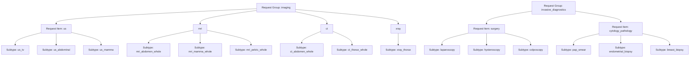
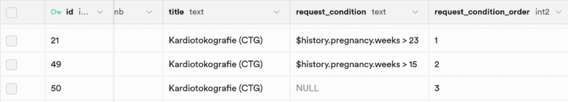
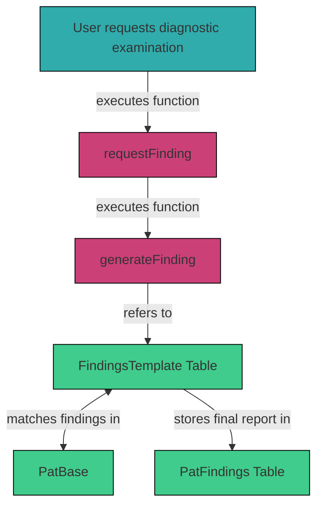

# 3.2.3 `FindingsTemplate`

The `FindingsTemplate` table enables automated rendering of written medical reports. For each diagnostic method (e.g., ultrasound, physical exam, surgery), it defines how findings from `pat_data` within the `PatBase` table are converted into a structured report when the user requests a diagnostic examination.

Each available diagnostic request (`request_type`) is represented by one row. Each row specifies the report layout (`template`), quantitative and qualitative parameters (`vars`), and text-mappings for pathological or abnormal findings (`vars_path`).

## Table Structure

| Column          | Format | Type   | Description                                                                          |
|-----------------|--------|--------|--------------------------------------------------------------------------------------|
| `id`            | bigint | number | Unique ID of each template                                                           |
| `request_group` | text   | string | Diagnostic group (e.g., `imaging`, `physical`, `microbiology`)                       |
| `request_item`  | text   | string | Diagnostic modality or item type (e.g., `us`, `mri`)                                 |
| `request_type`  | text   | string | Specific examination subtype (e.g., `us_tv`, `mri_abdomen`)                          |
| `title`         | text   | string | Report title as shown to the user                                                    |
| `template`      | text   | string | Report layout                                                                        |     
| `vars`          | jsonb  | json   | Definitions for normal values, sizes, positions, and default descriptions            |  
| `vars_path`     | jsonb  | json   | Definitions for textual descriptions of pathological findings                        |  
| `request_condition` | text   | string | Conditions, which are checked when selecting a finding template                  |
| `request_condition_order`| smallint   | number | Specifies the order of the conditions                                   |




To learn how categories and subcategories are defined and internally processed to render diagnostic reports based on the FindingsTemplate table described in this section, see [**Section 3.4.1 logic_server.js**](./3_4_1_logic_server.md), and [**Section 3.4.2 requests.js**](./3_4_2_requests.md).

### Template: Report Layout and Placeholders

The `template` field provides the layout and language of the final report. It uses placeholders to define where and how parameters and values are dynamically injected based on `pat_data`.

Each `template` starts with the clinical request fields:
- `$req.question`: clinical question
- `$req.diagnosis`: suspected diagnosis
- `$req.comment`: additional notes

**Placeholders**:
The `template` uses placeholders, that are filled with patient-specific findings and values from `pat_data`, which are then mapped to corresponding examination-specific parameters and text descriptions in `vars` or `vars_path`. If no pathological finding is present in `pat_data`, the system falls back to normal and/or default values as defined in `vars`.

Placeholders often follow the format: 
`$findings.organ.parameter`

Example `template` from `mri_pelvic_whole`:
```
Fragestellung: $req.question
Diagnose: $req.diagnosis
Kommentar: $req.comment

Uterus:
$findings.uterus.position 
$findings.uterus.height cm x $findings.uterus.width cm x $findings.uterus.depth cm
$findings.uterus.description
$findings.uterus.pathology

Endometrium:
$findings.endometrium.thickness mm
$findings.endometrium.description
$findings.endometrium.pathology

Zervix:
$findings.cervix.description
$findings.cervix.pathology

Ovar links:
$findings.ovary_l.height cm x $findings.ovary_l.width cm
$findings.ovary_l.description
$findings.ovary_l.pathology
...

Allgemein:
Gute Bildqualität ohne Bewegungsartefakte
$findings.common.pathology
```

The logic that renders these reports is defined in [**Section 3.4.1 logic_server.js**](./3_4_1_logic_server.md) and [**Section 3.4.3 `logic.js`**](./3_4_3_logic.md).

### vars: Normal and Default Values

The `vars` field contains organ-specific parameters, including sizes, measurements, position, and standard descriptions. 

These can take the form of:

1. Quantitative ranges with min and max values for randomization, e.g organ size:
```json
{ "uterus": {
    "depth": {
      "normal": {
        "max": 8,
        "min": 6.5
      }
    }
  }
}
```

2. Categorical values for probabilistic selection, e.g uterus position: 
```json
{ "uterus": {
    "position": {
      "normal": {
        "av/af": 0.9,
        "retro": 0.1,
        "singular": true
      }
    }
  }
}
```

The `singular: true` flag ensures only one item is selected per category (e.g., one uterus position).

3. Normal or default descriptions, when no pathology is present, e.g.: 
```json
{  "bowel": {
    "description": {
      "normal": {
        "static_value": "Darmabschnitte in normaler Weite und Wanddicke, kein Hinweis auf Ileus oder entzündliche Prozesse."
      }
    }
  }
}
```

Example `vars` from `mri_pelvic_whole`:
```json
{  "bowel": {
    "description": {
      "normal": {
        "static_value": "Darmabschnitte in normaler Weite und Wanddicke, kein Hinweis auf Ileus oder entzündliche Prozesse."
      }
    }
  },
  "cervix": {
    "description": {
      "normal": {
        "static_value": "Zervix regelrecht konfiguriert, kein Hinweis auf Stenose."
      }
    }
  },
  "uterus": {
    "depth": {
      "normal": {
        "max": 8,
        "min": 6.5
      },
      "uterine_enlargement": {
        "max": 12,
        "min": 8.5
      }
    },
    "width": {
      "normal": {
        "max": 5,
        "min": 4
      },
      "uterine_enlargement": {
        "max": 8,
        "min": 5.5
      }
    },
    "height": {
      "normal": {
        "max": 4.5,
        "min": 3
      },
      "uterine_enlargement": {
        "max": 7,
        "min": 5
      }
    },
    "position": {
      "normal": {
        "av/af": 0.9,
        "retro": 0.1,
        "singular": true
      },
      "uterine_retroversion": {
        "av/af": 0,
        "retro": 1,
        "singular": true
      }
    },
    "description": {
      "normal": {
        "static_value": "Uterus regelrecht konfiguriert mit homogenem Myometrium ohne fokalen Läsionen."
      }
    }
  }
}
```

### vars_path: Descriptions for Pathological Findings

The `vars_path` field maps each patient-specific finding in `pat_data` to a textual description to be inserted into the report. When a finding (e.g., "tubo_ovarian_abscess") is present in pat_data and has a corresponding `vars_path` entry, its text is inserted at the `$findings.organ.pathology` placeholder.

Example `vars_path` from `mri_pelvic_whole`:
```json
{  "bowel": {
    "colon_endometriosis": "Infiltrative, signalalterierte Läsionen an Rektum und Sigma, vereinbar mit kolorektalen Endometrioseherden.",
    "colon_wall_thickening": "Segmentale Wandverdickung des Kolons, vereinbar mit entzündlicher Genese."
  },
  "ovary_l": {
    "extrauterine_sac": "Extrauterine Raumforderung mit ringförmiger Kontrastmittelanreicherung, vereinbar mit Tubargravidität.",
    "multiple_follicles": "Linkes Ovar mit multiplen peripheren Follikeln.",
    "tubo_ovarian_abscess": "Unklare adnexale Raumforderung links mit umgebender Entzündungsreaktion, verdächtig auf tuboovariellen Abszess.",
    "postmenopausal_ovaries": "Linkes Ovar entsprechend eines postmenopausalen Normalbefundes atroph, klein und homogen ohne erkennbare Follikelstrukturen."
  },
  "lymph_nodes": {
    "pelvic_lymphadenopathy": "Multiple vergrößerte Lymphknoten im kleinen Becken, differenzialdiagnostisch reaktiv oder neoplastisch."
  }
}
```

### Request Conditions

A request condition can be added if the selection of a finding template differs by this special condition, for example the pregnancy week. As you can see in the graphic below, three different templates for cardiotocography were added. The selection of the right template is based on the order of the conditions and the conditions themselves. In this example, it would be checked first, if the patient is at least 24 weeks pregnant. If this condition is satisfied, the template is selected and other conditions won't be checked anymore. If the first condition is not satisfied, the second condition is checked. This continues until the template with no given condition is reached and selected, if no other template gets chosen before. 



## Integration within the System

When a user requests a diagnostic examination (e.g., `us_tv`), the system fetches the matching entry from the `FindingsTemplate` table. First, the `template` field provides the layout and placeholders. Then, the system refers to the `pat_data` for relevant findings. If pathological findings are present, they are matched against `vars_path`, and corresponding texts are injected. For all remaining parameters and placeholders with no pathology in `pat_data`, the system falls back to normal/default values and descriptions in `vars`. The complete written report is assembled and stored in the `PatFindings` table.


