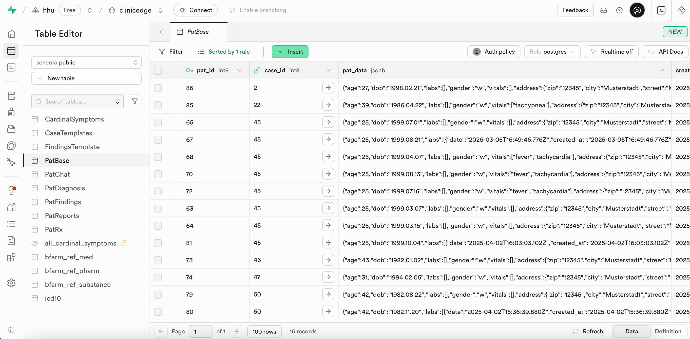

#### 3.2.4 `PatBase`

### Table Structure

Dynamic patient cases are generated from `case_data` within `CaseTemplates` applying probabilistic variations.

- age:
- lab values: randomized between min/max or from normal range
- findings: rendered based on the probabilities (e.g., "tuboovarian_abscess": 0.2)

Each generated case receives a unique `pat_id`. This structure allows infinite, non-repeating patient cases.