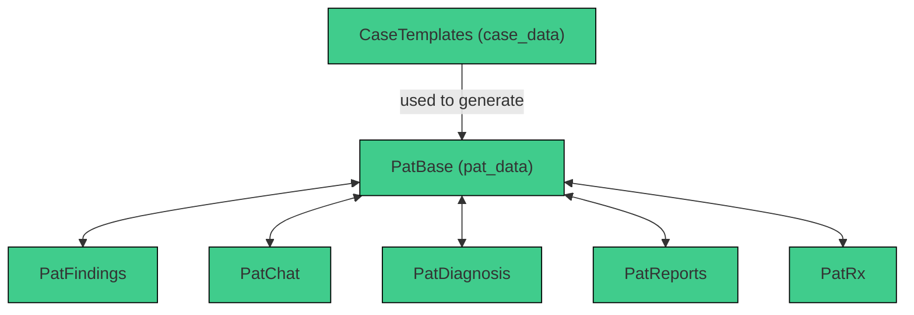
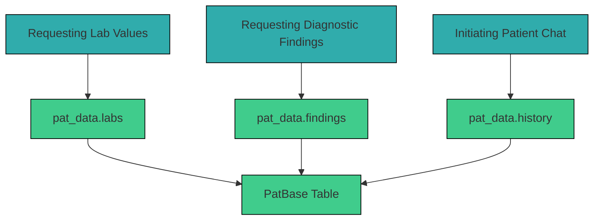

# 3.2.4 `PatBase`

The `PatBase` table in Supabase stores all dynamically and statically generated patient cases. Each patient case is assigned a unique `pat_id` and is linked to a case/diagnosis via `case_id`. While multiple patient cases can originate from the same `case_id`, each `pat_id` exists only once. 

The `pat_data` contains all patient-specific findings and values in JSON format and is generated from `case_data` within the `CaseTemplates` Table. It includes information such as age, gender, lab values, findings, vitals, medical history, and more. 

## Table Structure

| Column        | Format  | Type   | Description                                                               |
|---------------|---------|--------|---------------------------------------------------------------------------|
| `pat_id`     | bigint   | number | Internal ID for each generated patient case                               |
| `case_id`     | bigint  | number | Internal ID for each case template                                        |
| `pat_data`   | jsonb    | json   | JSON object containing all generated patient-specific parameters          |


Example `pat_data`:
```json
{
  "age": 29,
  "dob": "1996.01.04",
  "labs": [
    {
      "date": "2025-06-18T10:57:29.721Z",
      "created_at": "2025-06-18T10:57:29.721Z",
      "measurements": {
        "urine_status": {
          "urine_rbc": 2.23,
          "urine_wbc": 22.21,
          "urine_bakteria": 857.37,
          "urine_protein_creatinine": 116.82
        }
      }
    }
  ],
  "gender": "w",
  "vitals": {
    "text": [
      "fever"
    ],
    "values": {
      "heart_rate": 77,
      "temperature": 39.6,
      "respiratory_rate": 14,
      "blood_pressure_systolic": 103,
      "blood_pressure_diastolic": 73
    }
  },
  "address": {
    "zip": "12345",
    "city": "Musterstadt",
    "street": "Musterstraße 1"
  },
  "history": {
    "menstruation": "normal",
    "general_history": {
      "bmi": 18,
      "height": 179,
      "weight": "58",
      "surgeries": [
        "common_surgeries_women"
      ],
      "pre_existing_conditions": [
        "common_pre_existing_conditions_women"
      ]
    }
  },
  "findings": [],
  "imageUrl": "",
  "vignette": "Sie arbeiten in der gynäkologischen Ambulanz des UKDs. Frau Schneider (w, 29) stellt sich mit Dysurie und Pollakisurie bei Ihnen vor. \n\n 
              **Vitalzeichen**: \n\n Puls: 77/min Atemfrequenz: 14/min \n\n RR 103/73 mmHg \n\n Temperatur: 39.6°C",
  "insurance": {
    "name": "Musterkasse",
    "number": "01234567890"
  },
  "name_last": "Schneider",
  "dependants": [
    {
      "phone": "0211 01234",
      "relation": "partner",
      "name_last": "Mustermann",
      "name_first": "Bernd"
    }
  ],
  "name_first": "Mara",
  "findings_global": null,
  "vignette_patient": "Sie sind Frau Schneider, 29 Jahre alt. Seit gestern verspüren Sie Brennen beim Wasserlassen und müssen ständig auf die Toilette. 
                      Sie hatten früher schon öfter Blasenentzündungen.",
  "cardinal_symptoms": [
    "dysuria",
    "pollakisuria",
    "hematuria",
    "fever"
  ]
}
```

## Integration within the System

The `pat_data` serves as the basis for nearly all user interactions in a patient case. When a user performs an action, the system pulls the corresponding information from `pat_data`. 



Typical examples of when `pat_data` is retrieved:

For example:


All of these actions refer back to the `pat_data` within the `PatBase` table via the `pat_id`.