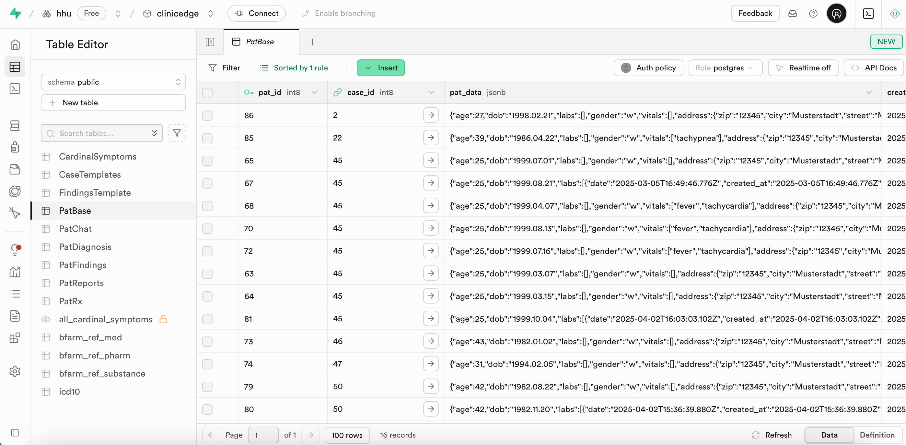

# 3.2.4 `PatBase`

### Table Structure

| Column        | Format  | Type   | Description                                                               |
|---------------|---------|--------|---------------------------------------------------------------------------|
| `pat_id`     | bigint  | number | Internal ID for each generated patient case                                |
| `case_id`     | bigint  | number | Internal ID for each case template                                        |
| `pat_data`   | jsonb   | json   | JSON object containing all generated patient-specific parameters           |

Dynamic patient cases are generated from `case_data` within `CaseTemplates` applying probabilistic variations.

- age:
- lab values: randomized between min/max or from normal range
- findings: rendered based on the probabilities (e.g., "tuboovarian_abscess": 0.2)

Each generated case receives a unique `pat_id`. This structure allows infinite, non-repeating patient cases.