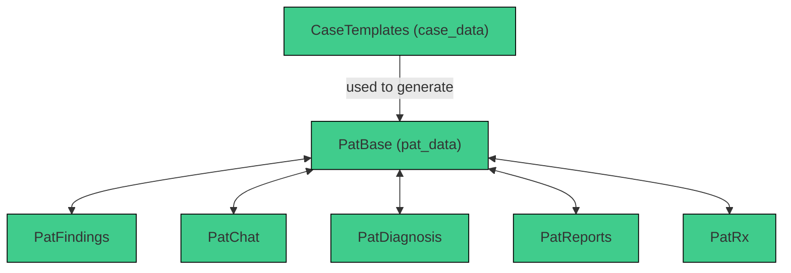
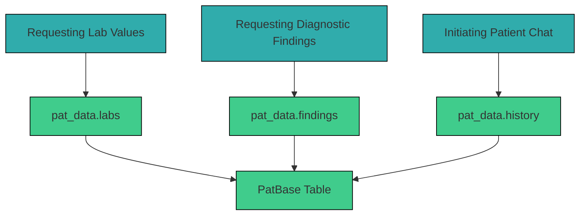

# 3.2.4 `PatBase`

The `PatBase` table in Supabase stores all dynamically and statically generated patient cases. Each patient case is assigned a unique `pat_id` and is linked to a case/diagnosis via `case_id`. While multiple patient cases can originate from the same `case_id`, each `pat_id` exists only once. 

The `pat_data` contains all patient-specific findings and values in JSON format and is generated from `case_data` within the `CaseTemplates` Table. It includes information such as age, gender, lab values, findings, vitals, medical history, and more. 

## Table Structure

| Column        | Format  | Type   | Description                                                               |
|---------------|---------|--------|---------------------------------------------------------------------------|
| `pat_id`     | bigint   | number | Internal ID for each generated patient case                               |
| `case_id`     | bigint  | number | Internal ID for each case template                                        |
| `pat_data`   | jsonb    | json   | JSON object containing all generated patient-specific parameters          |


Example `pat_data`:
```json

```

## Integration within the System

The `pat_data` serves as the basis for nearly all user interactions in a patient case. When a user performs an action, the system pulls the corresponding information from `pat_data`. 



Typical examples of when `pat_data` is retrieved:

For example:


All of these actions refer back to the `pat_data` within the `PatBase` table via the `pat_id`.