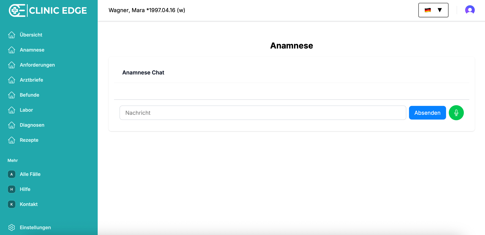
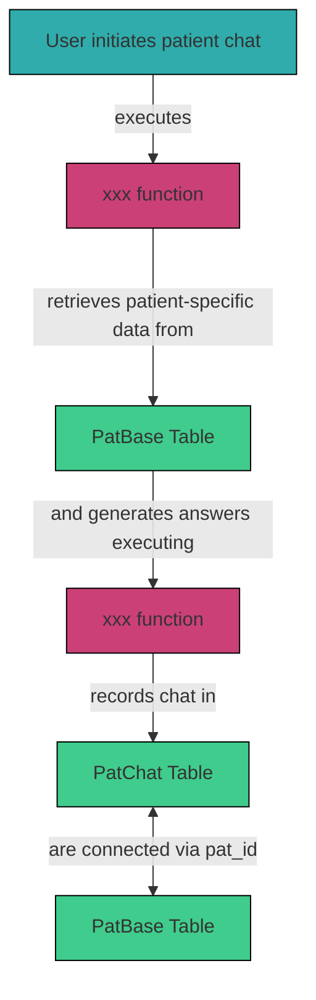

# 3.2.5 `PatChat`

Clinic Edge offers the functionality to take the medical history of a patient via chatting with an AI bot (text or audio). The information, which is gathered during the anamnesis, is stored in the `PatChat` table in Supabase and assigned to the patient case using the `pat_id` (as in `PatBase`). In addition to the `content` of the conversation, the table also contains some audio information if this functionality is used.



## Table Structure

| Column     | Format | Type   | Description                                                              |
|------------|--------|--------|--------------------------------------------------------------------------|
| `id`       | bigint | number | Unique ID of each statement (from the Patient/AI bot) or question (from the user)|
| `pat_id`   | bigint | number | Corresponding patient case (as in `PatBase`)                             |
| `content`  | jsonb  | json   | Conversation content                                                     |
| `audio`    | jsonb  | json   | Audio content if audio functionality is used (optional)                  |

Example `content`:

User:
```
Nehmen Sie Medikamente?
```
Patient:
```
Nein, ich nehme keine Dauermedikation ein.
```

## Integration within the System

When a user initiates the patient chat, the system fetches `pat_data` from `PatBase` and uses the AI model `xxx` to provide responses and run the conservation. The `pat_data` contains all patient-specific findings and values in JSON format and is generated from `case_data` within the `CaseTemplates` Table. For details on the structure and content of `pat_data`, see [**Section 3.2.4 PatBase**](./3_2_4_pat_base.md).

The chat, including text and optionally audio, is recorded and stored in the `PatChat` table in Supabase. Each entry is linked to the corresponding patient via `pat_id`. 

