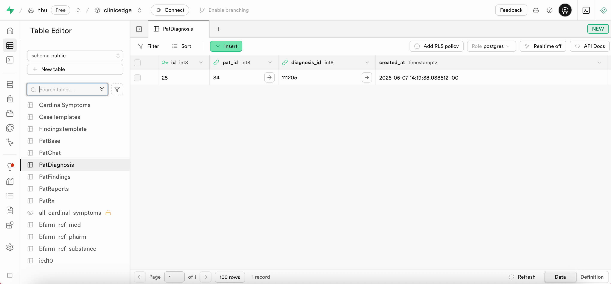
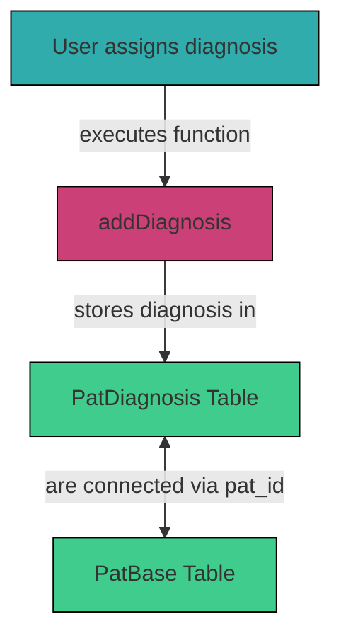

# 3.2.6 `PatDiagnosis` 

The `PatDiagnosis` table in Supabase stores the ICD-10 diagnoses assigned to a patient case by the user. Each diagnosis is defined by a `diagnosis_id` and linked to the corresponding patient via `pat_id` as in the `PatBase` table.

## Table Structure

| Column         | Format     | Type       | Description                                                          |
|----------------|------------|------------|----------------------------------------------------------------------|
| `id`           | bigint     | number     | Unique identifier for this diagnosis entry                           |
| `pat_id`       | bigint     | number     | Corresponding patient case (as in `PatBase`)                         |
| `diagnosis_id` | bigint     | number     | ICD-10 diagnosis code                                                |

## Integration within the System

