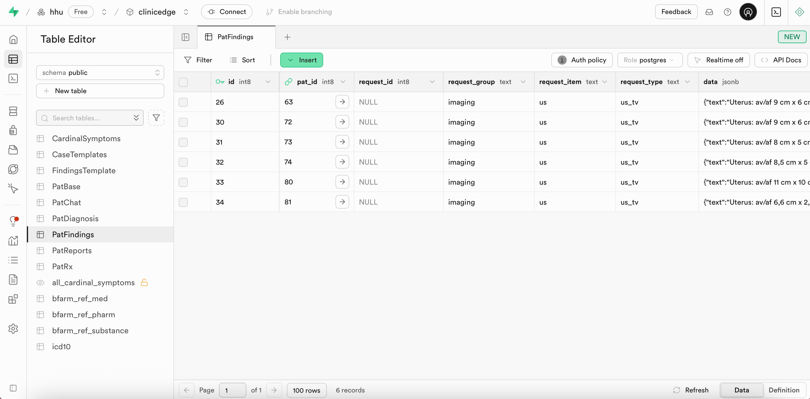
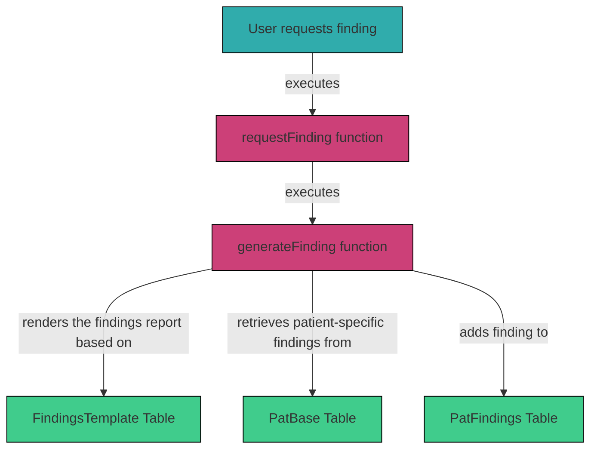

# 3.2.7 `PatFindings` 

The `PatFindings` table in Supabase contains all diagnostic findings requested by the user for each patient case. Every diagnostic request is represented by a single row and inludes the examination group, item, and type, as well as the generated report. Each finding is linked to the corresponding patient via `pat_id`.

| Column          | Format | Type   | Description                                                                 |
|-----------------|--------|--------|-----------------------------------------------------------------------------|
| `id`            | bigint | number | ?                                                                           |
| `pat_id`        | bigint | number | Corresponding patient case (as in `PatBase`)                                |
| `request_id`    | bigint | number | ?                                                                           |
| `request_group` | text   | string | Diagnostic group (e.g., `imaging`, `physical`, `microbiology`)              |
| `request_item`  | text   | string | Diagnostic modality or item type (e.g., `us`, `mri`)                        |
| `request_type`  | text   | string | Specific examination subtype (e.g., `us_tv`, `mri_abdomen`)                 |
| `data`          | jsonb  | json   | Generated report (including `title`, `text`, and optional `images`)         |



Example request:

- `request_group`: `"imaging"`  
- `request_item`: `"us"`  
- `request_type`: `"us_tv"`  

Example `data`:
```json
{
  "text": "Uterus: av/af 9 cm x 6 cm x 3,5 cm; Endometrium flach. \n Ovar links: 3 cm x 1,5 cm x 1 cm, o.p.B. \n Ovar rechts: 3,5 cm x 2,5 cm x 1 cm; zystische, unscharf begrenzte ovarielle RF (2 cm x 1 cm x 1cm) in Form eines Tuboovarialabszesses; rechtes Adnex geschwollen. \n Zervix: o.p.B. \n Allgemein: Gute Ultraschallbedingungen.",
  "title": "Transvaginaler Ultraschall",
  "images": [
    "https://files.clinic-edge.org/images/tvus/test.jpg"
  ]
}
```

### Integration within the System

When a user requests a diagnostic test (e.g., `us_tv`), the system first executes the `requestFinding` function, which then runs the `generateFinding` function in `logic_server.js`. The corresponding report template is fetched from the `FindingsTemplate` table in Supabase. Patient-specific findings are retrieved from `pat_data` in `PatBase`, and the findings and values are inserted into the report template as defined in `vars` and `vars_path` within the `FindingsTemplate` table. The final report is stored in the `PatFindings` table.

