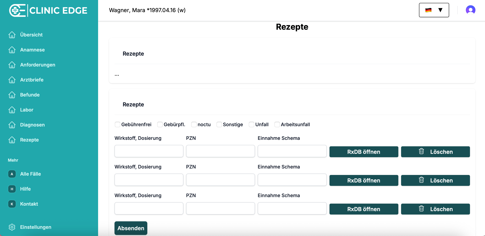
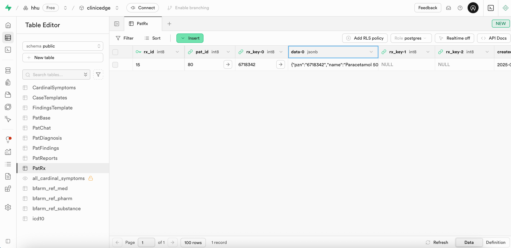
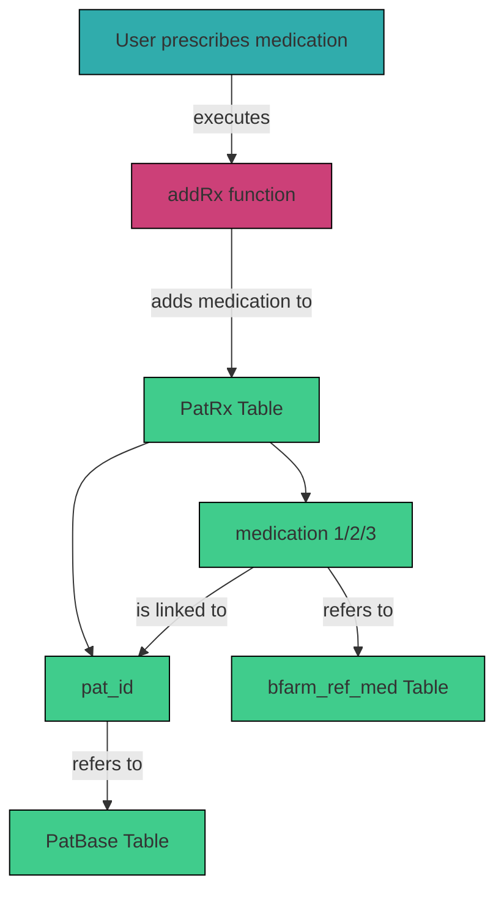

# 3.2.9 `PatRx` 

The `PatRx` table in Supabase stores all prescriptions for each patient case. Each medication is linked to a patient via `pat_id` and receives a unique `rx_id`. The table supports storage of up to three medications, with metadata including the medication name, Pharmazentralnummer (PZN), and an internal `rx_key`. 



### Table Structure

| Column      | Format | Type   | Description                                                                 |
|-------------|--------|--------|-----------------------------------------------------------------------------|
| `pat_id`    | bigint | number | Internal ID of the patient receiving the prescription (as in `PatBase`)     |
| `rx_id`     | bigint | number | Unique prescription ID                                                      |
| `data-0`    | jsonb  | json   | Metadata for medication 1 (e.g., `pzn`, `name`, `rx_key`)                   |
| `data-1`    | jsonb  | json   | Metadata for medication 2 (e.g., `pzn`, `name`, `rx_key`)                   |
| `data-2`    | jsonb  | json   | Metadata for medication 3 (e.g., `pzn`, `name`, `rx_key`)                   |
| `rx_key-0`  | text   | string | Internal medication key for medication 1                                    |
| `rx_key-1`  | text   | string | Internal medication key for medication 2                                    |
| `rx_key-2`  | text   | string | Internal medication key for medication 3                                    |



Example medication metadata:
```json
{
  "pzn": "6718342",
  "name": "Paracetamol 500 mg (Tabl)",
  "rx_key": "6718342"
}
```

### Integration within the System

Medications are added to the `PatRx` table using the `addRx` function in `logic_server.js`. Medication metadata includes `pzn` and `rx_key`, which are matched to `RMP_PZN` and `RMP_KEY` in the `bfarm_ref_med` table in Supabase. Each prescription is linked to the correct patient case via `pat_id`.

