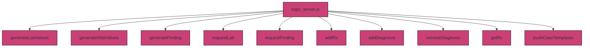
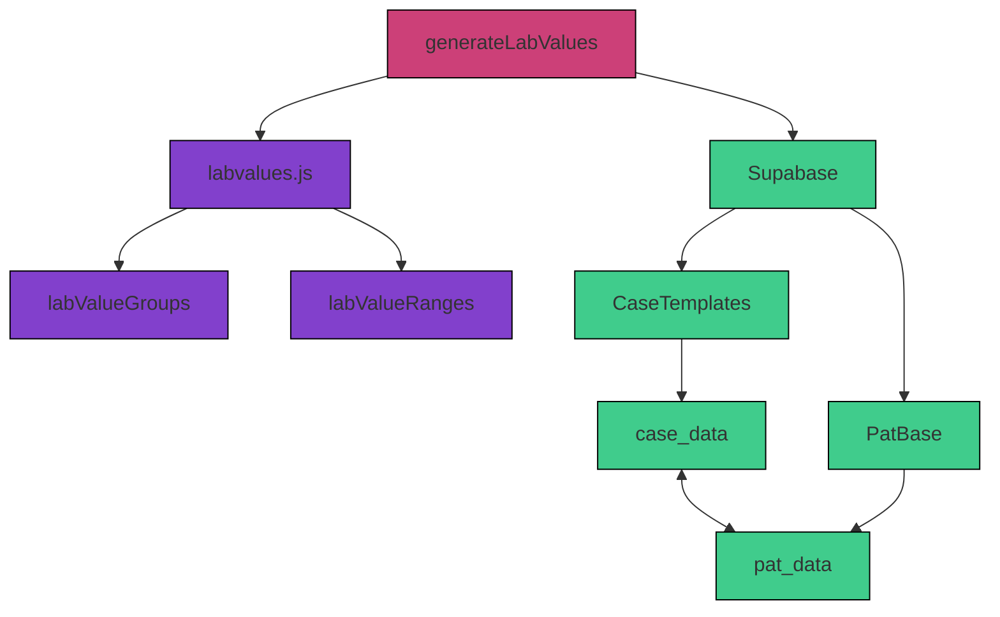
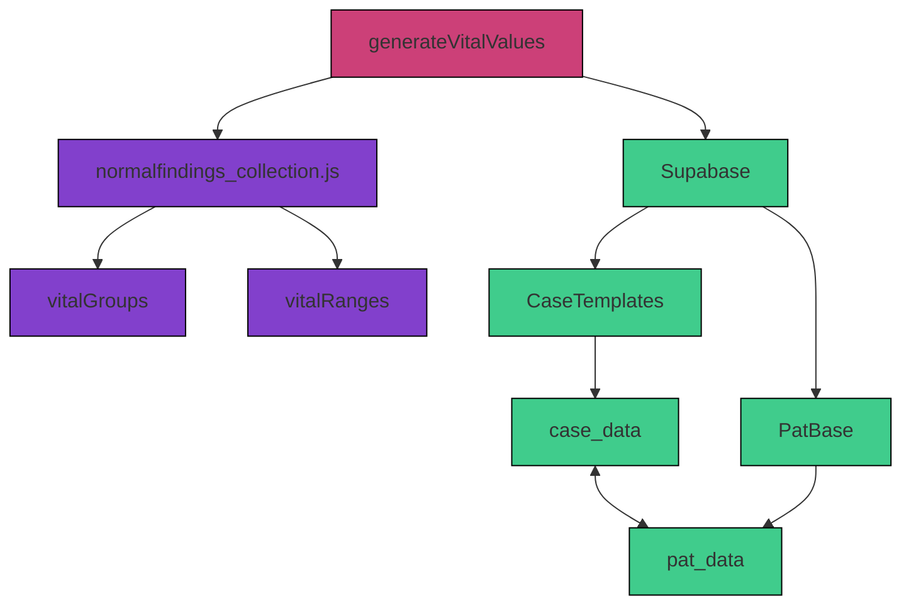
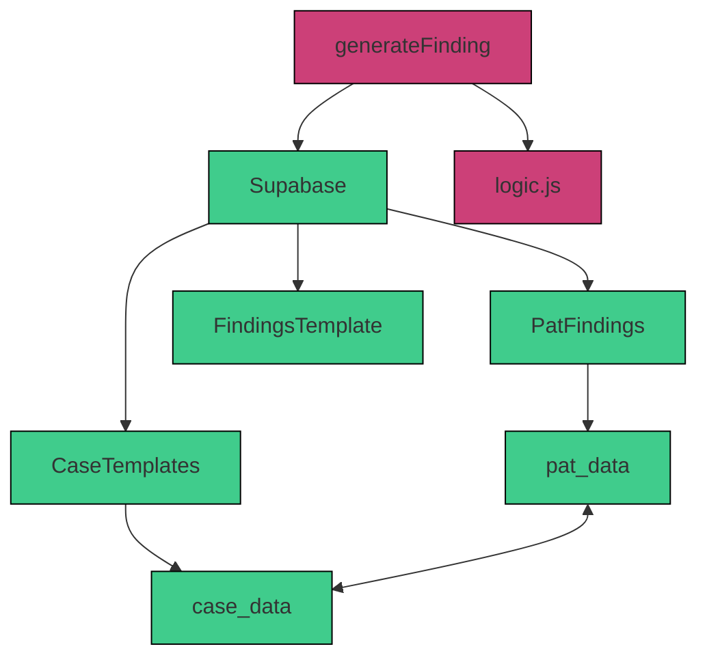
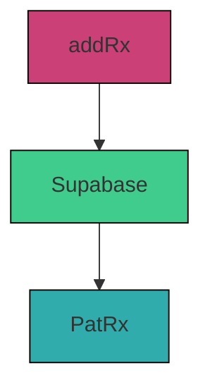

#### 3.4.1  `logic_server.js`

The `logic_server.js` file contains logic functions to process and transform patient-specific data. It acts as connection between the Supabase database and the Clinic Edge application. 

This script includes functions for:
- Generating lab values and vital signs
- Requesting, creating and storing diagnostic findings
- Prescribing medications
- Assigning and removing diagnoses

These functions in `logic_server.js` rely on internal reference files such as `labvalues.js` and `normalfindings_collection.js`, and interact with functions from `logic.js`. For more details on system logic, and how data flows, see [**4.1 System Logic**](../4_1_system_logic.md).

##### Key Functions

##### 1. `generateLabValues`

**What it does:**  
Randomly generates lab values based on predefined ranges from `labvalues.js`

**What it connects to:**  
- Lab groups from `labValueGroups` in `labvalues.js`
- Retrieves ranges from `labValueRanges` in `labvalues.js` or `path_lab_ranges`

**How it can be modified:**  
- Add or adjust lab value reference ranges in `labvalues.js`
- Define case-specific lab values and ranges directly in `case_data` in the `CaseTemplates` Table via Supabase

##### 2. `generateVitalValues`

**What it does:**  
Generates realistic vital sign values (e.g., heart rate, temperature) using general or case-specific ranges.

**What it connects to:**  
- Vital sign groups from `vitalGroups` in `normalfindings_collection.js`
- Value ranges from `vitalRanges` in `normalfindings_collection.js` or `path_vital_ranges`

**How it can be modified:**  
- Add or adjust vital sign reference ranges in `normalfindings_collection.js`
- Define case-specific vital sign values directly in `case_data` in the `CaseTemplates` Table via Supabase

##### 3. `generateFinding`

**What it does:**  
Creates a written diagnostic report for an examination request (e.g. ultrasound or physical exam)

**What it connects to:**  
- Retrieves template layout from the `FindingsTemplate` Table via Supabase
- Generates measurements via `vars`and written pathology descriptions via `vars_path` from the `FindingsTemplate` Table via Supabase 
- Integrates global patient findings from `pat_data.findings_global` in the `PatFindings` Table 
  - `pat_data` generated based on `case_data` in the `CaseTemplates Table via Supabase

**How it can be modified:**  
- Adjust template, vars, and vars_path in `FindingsTemplate` Table via Supabase
- Modify case-specific findings in `case_data` in the `CaseTemplates` Table via Supabase

##### 4. `requestLab`

**What it does:**  
Executes the generation of a lab value report using the `generateLabValues` function, when the user requests lab values

**What it connects to:**  
- Executes `generateLabValues` function (see above) to fetch and randomize lab values

**How it can be modified:**  

##### 5. `addRx`

**What it does:**  
Stores medications for a patient in the `PatRx` Table via Supabase

**What it refers/connects to:**  

**How it can be modified:**  

##### 6. `requestFinding`

**What it does:**  
Executes the generation of an examination report using the `generateFinding`function and saves it to `PatFindings`, when the user requests an examination

**What it refers/connects to:**  
- Executes `generateFinding` function (see above)
- Stores the report into the `PatFindings` Table via Supabase

**How it can be modified:**  

##### 7. `addDiagnosis` & `removeDiagnosis`

**What it does:**  
Adds or removes diagnoses (ICD-10 codes) from a patient's record and stores it in `PatDiagnosis` via Supabase

**What it refers/connects to:**  
- Collects diagnoses in the `PatDiagnosis` Table via Supabase

**How it can be modified:**  

##### 8. `pushCaseTemplates`

**What it does:**  

**What it refers/connects to:**  

**How it can be modified:**  
