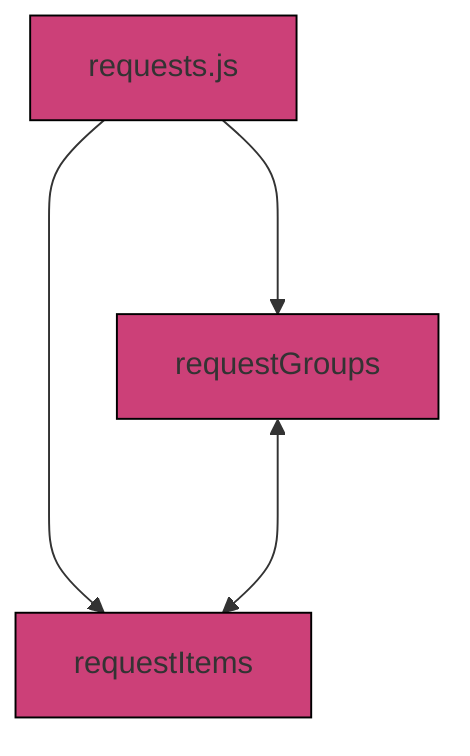
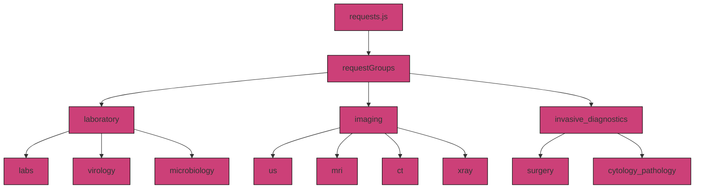
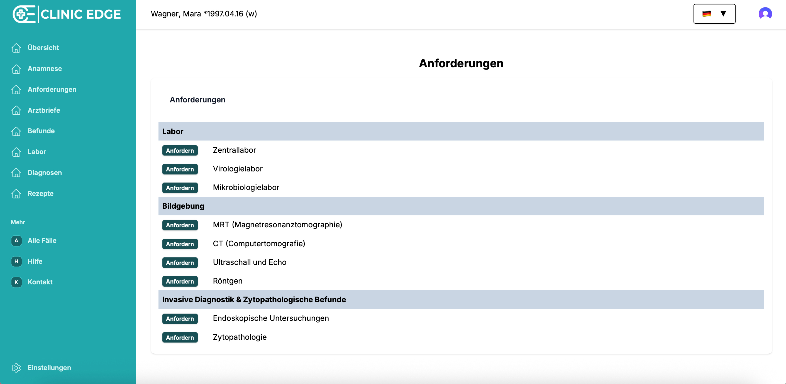
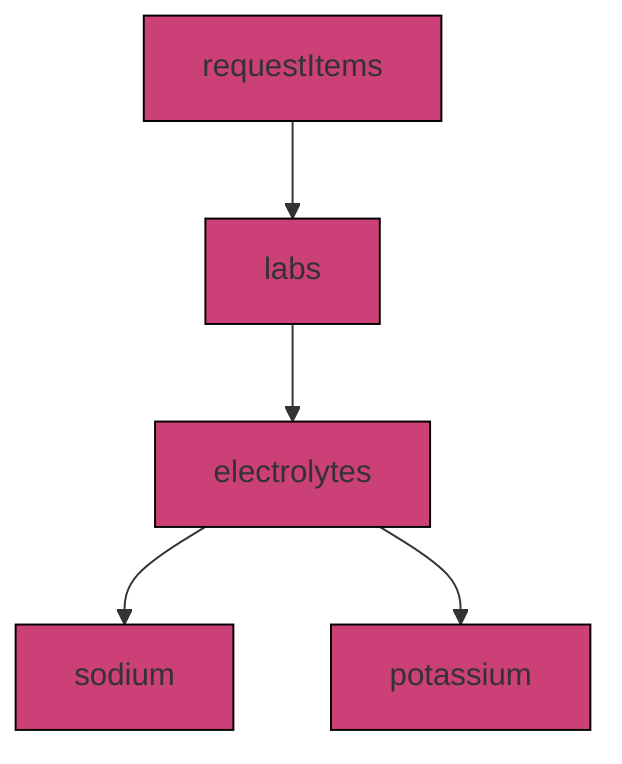
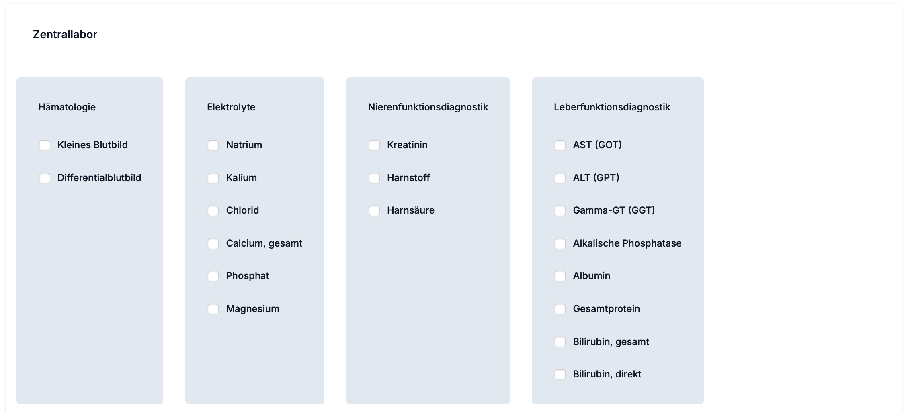
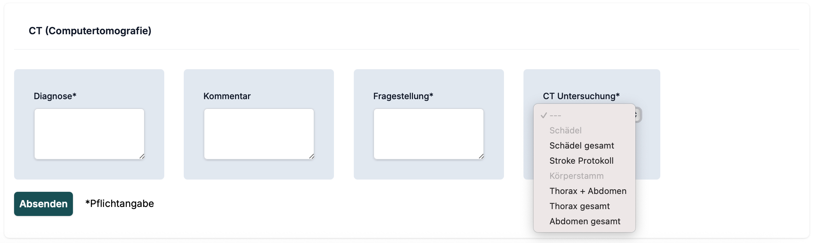

# 3.4.2 `requests.js`

The `requests.js` file defines all available diagnostic requests in the ClinicEdge application. It sets the basis for the user interface, organizing diagnostic request categories, subcategories, and the selectable items the user can request. 

This script defines:
- Diagnostic request groups and corresponding items (`requestGroups`)
- Form layouts, categories, and test keys (`requestItems`)



## Key Definitions

### 1. `requestGroups`

**What it does:**  
Defines the top-level diagnostic categories available in ClinicEdge and their associated `requestItems`

**What it connects to:**  
- `request_group` field in `FindingsTemplate` table 
- `request_group` field in `PatFindings` table
- `generateFinding` function in `logic_server.js`
- `requestItems` in `requests.js` (see below)

**How it can be modified:**  
- Add or remove diagnostic groups
- Add or remove request items within each group

Hierarchy overview:
```
request_group
├── laboratory
│   ├── labs
│   ├── virology
│   └── microbiology
├── imaging
│   ├── mri
│   ├── ct
│   ├── us
│   └── xray
└── invasive_diagnostics
│   ├── surgery
│   └── cytology_pathology
```

Example:
```js
export const requestGroups = {
  laboratory: {
    items: ["labs", "virology", "microbiology"],
  },
  imaging: {
    items: ["mri", "ct", "us", "xray"],
  },
    invasive_diagnostics: {
    items: ["surgery", "cytology_pathology"],
  }
};
```





### 2. `requestItems`

**What it does:**  
Defines the structure and hierarchy of each `request_item`, including:
- UI form layout (e.g. `checkbox`)
- Subcategories (e.g. `labs > electrolytes`)
- Test keys (e.g. `labs > electrolytes > sodium, potassium`)

**What it connects to:**  
- Presentation of request forms in the ClinicEdge application
- `generateLabValues` in `logic_server.js` for lab requests 
- `generateFinding` in `logic_server.js` for all other diagnostic requests
- Normal or default ranges and findings as defined in `labvalues.js` (labs) and `normalfindings_collection.js` (vitals, microbiology, history)
- `vars` and `vars_path` in the `FindingsTemplate` table
- Categories as defined in `requestGroups` in `requests.js` (see above)

**How it can be modified:**  
- CHange the form layout
- Add, remove or modify subcategories
- Add, remove or modify test keys within a category

Hierarchy overview:



```
requestItems
├── labs
│   └── electrolytes
│       ├── sodium
│       └── potassium
├── virology
├── microbiology
├── mri
├── ct
├── us
├── xray
├── surgery
└── cytology_pathology
```

Example 1:
```js
export const requestItems = {
  labs: {
    form: {
      electrolytes: {
        type: "checkbox",
        required: false,
        choices: {
          sodium: {
            type: "option",
          },
          potassium: {
            type: "option",
          },
```



Example 2:
```js
  ct: {
    form: {
      ct_diagnosis: {
        type: "text",
        required: true,
      },
      ct_comment: {
        type: "text",
        required: false,
      },
      ct_question: {
        type: "text",
        required: true,
      },
      ct_type: {
        type: "select",
        required: true,
        choices: {
          ct_skull: {
            type: "heading",
          },
          ct_skull_whole: {
            type: "option",
          },
          ct_skull_stroke: {
            type: "option",
          },
          ct_trunk: {
            type: "heading",
          },
          ct_thorax_abdomen: {
            type: "option",
          },
```
