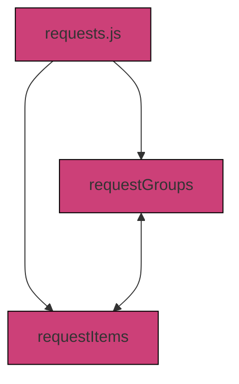
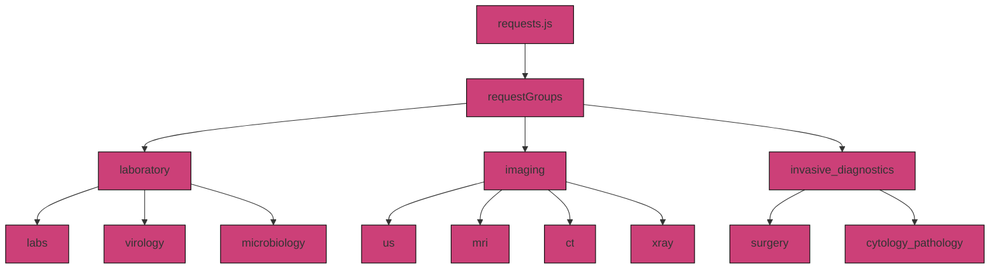
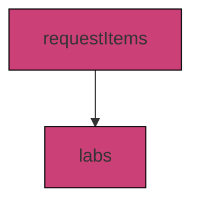

# 3.4.2 `requests.js`

The `requests.js` file contains functions to ...

This script defines:
- request groups and their items (`requestGroups`)
- layouts, categories, and test choices (`requestItems`)

## Key Definitions

### 1. `requestGroups`

**What it does:**  
Defines all available diagnostic categories of CLinicEdge and their associated items

**What it connects to:**  
- `request_group` field in `FindingsTemplate` table 
- `request_group` field in `PatFindings` table
- `generateFinding` function in `logic_server.js`
- `requestItems` in `requests.js` (see below)

**How it can be modified:**  
- Add or remove groups and associated items

### 2. `requestItems`

**What it does:**  

**What it connects to:**  
- Presentation of request forms in the Clinic Edge application
- `generateLabValues` in `logic_server.js` for lab requests 
- `generateFinding` in `logic_server.js` for all other diagnostic requests
- Normal or default ranges and findings as defined in `labvalues.js` (labs) and `normalfindings_collection.js` (vitals, microbiology, history)
- `vars` and `vars_path` in the `FindingsTemplate` table
- `requestGroups` in `requests.js` (see above)

**How it can be modified:**  
- Add or remove request types and define their categories and options
- Add or remove keys within a category

