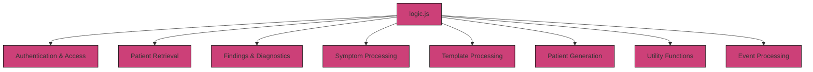

# 3.4.3 `logic.js`

The `logic.js` file contains ...

This script includes functions for:

## Key Functions

### 1. Authentication & Access 
#### 1.1 `checkPatient`  
#### 1.2 `checkPatientExists`  

### 2. Patient Retrieval
#### 2.1 `getPatient`  
#### 2.2 `getAllPatients`  

### 3. Findings & Diagnostics  
#### 3.1 `getFindings`  
#### 3.2 `getLabs`  
#### 3.3 `getVitals`  
#### 3.4 `getDiagnosis`  
#### 3.5 `getICD`  

### 4. Symptom Processing
#### 4.1 `getAllCardinalSymptoms`  
#### 4.2 `getCardinalSymptom`  

### 5. Template Processing
#### 5.1 `getAllCaseTemplates`  
#### 5.2 `getCaseTemplates`  
#### 5.3 `getTemplate`  
#### 5.4 `getAllTemplates`  

### 6. Patient Generation  
#### 6.1 `generateAndPushPatient`  
#### 6.2 `generatePatient`  
#### 6.3 `pushPatient`  
#### 6.4 `generateCaseData` 

### 7. Utility Functions
#### 7.1 `getRandomInt`  
#### 7.2 `getRandomElement`  
#### 7.3 `getRandomDate`  
#### 7.4 `selectWeightedRandom`  

### 8. Event Processing  
#### 8.1 `getEvents`  
#### 8.2 `getEventsGlobalWrapper`  
#### 8.3 `getEventsWrapper`  
#### 8.4 `processObject`  
#### 8.5 `processObjectWrapper`  
#### 8.6 `calculateAge`  
#### 8.7 `mergeNestedObjects`  
#### 8.8 `generateReport`
