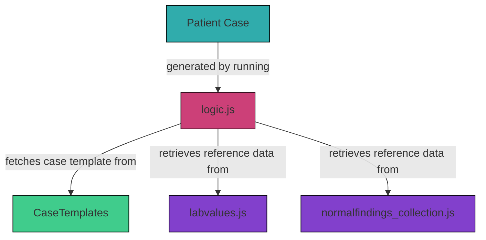

# 3.5 Reference Data

If a field or value in `case_data` is defined as `"normal"` or blank, data is automatically retrieved from predefined reference files and injected into the into the dynamically generated `pat_data`.

1. `normalfindings_collection.json`: contains static written findings or probabilistically generated values for diagnostic categories such as microbiology, menstruation, history, and vitals
2. `labvalues.json`: contains numeric reference ranges for laboratory values, optionally including gender and age stratification or multiple units



## 3.5.1 `normalfindings_collection.js`

This file contains written findings and probabilistically generated values for multiple diagnostic categories. 
All entries are grouped by category keys, such as `"history"`, `"menstruation"`, `"microbiology"`, etc.

Here is a simplified structure overview:
```
normalfindings_collection
├── normalfindings_invasive_diagnostics
├── normalfindings_microbiology
├── normalfindings_history
├── vitalGroups
└── vitalRanges
```


```
normalfindings_invasive_diagnostics
├── invasive_diagnostics
│   └── cytology_pathology
│       ├── pap_smear
│       │   └── normal
│       ├── hpv_test
│       │   └── normal
│       ├── breast_biopsy
│       │   └── normal
│       ├── cervical_biopsy
│       │   └── normal
│       ├── endometrial_biopsy
│       │   ├── normal_
│       │   └── normal_during_postmenopause
│       ├── ovarian_biopsy
│       │   └── normal
│       └── vulvar_biopsy
│           └── normal
```

```
normalfindings_microbiology
├── microbiology
│   ├── urinalysis
│   │   ├── normal
│   │   └── normal_during_pregnancy
│   └── vaginal_swab
│       ├── normal
│       └── normal_during_postmenopause
```

```
normalfindings_history
├── history
│   ├── general_history
│   │   ├── surgeries
│   │   │   └── common_surgeries_women
│   │   └── pre_existing_conditions
│   │       └── common_pre_existing_conditions_women
│   └── menstruation
│       ├── normal
│       │   ├── menarche
│       │   ├── last_menstrual_period
│       │   ├── bleeding_pattern
│       │   ├── cycle_length
│       │   ├── menstrual_duration
│       │   ├── intermenstrual_bleeding
│       │   ├── bleeding_intensity
│       │   ├── dysmenorrhea_occurence
│       │   └── contraception
│       └── normal_during_postmenopause
│           ├── menarche
│           ├── last_menstrual_period
│           ├── bleeding_pattern
│           └── contraception
```

```
vitalGroups
└── vitals
    ├── temperature
    ├── respiratory_rate
    ├── blood_pressure_systolic
    ├── blood_pressure_diastolic
    └── heart_rate
```

```
vitalRanges
├── temperature
│   ├── normal
│   ├── fever
│   └── hypothermia
├── respiratory_rate
│   ├── normal
│   └── tachypnea
├── blood_pressure_systolic
│   ├── normal
│   ├── hypotension
│   └── hypertension
├── blood_pressure_diastolic
│   ├── normal
│   ├── hypotension
│   └── hypertension
└── heart_rate
    ├── normal
    └── tachycardia
```

Normal findings can take the form of:

### 1. Static written normal findings
Predefined report text can be inserted into `pat_data` when `"normal"` is defined. 

**Example:**
```json
"microbiology": {
  "urinalysis": {
    "normal": {
      "urine_culture": {
        "text": "Keimzahl: Kein signifikantes Wachstum. Identifizierte Erreger: Keine oder vereinzelte nicht-pathogene Bakterien."
      }
    }
  }
}
```

### 2. Probabilistic value generation with singular constraint
Some values are generated based on defined probabilities. This allows the simulation of realistic clinical distributions for findings such as menstrual characteristics or pre-existing conditions.

**Example:**
```json
"history": {
  "general_history": {
    "menstruation": {
      "normal": {
        "menarche": {
          "12y": 0.1,
          "13y": 0.2,
          "14y": 0.4,
          "15y": 0.2,
          "16y": 0.1,
          "singular": true
        }
      }
    }
  } 
}  
```         

One value will be selected based on the probabilities. The `"singular": true` flag ensures only one value from the set is selected.

### 3. Probabilistic value generation without singular constraint
The probabilistic model can also be used to without the `"singular": true` flag to generate multiple co-occurring findings, such as past surgeries or pre-existing conditions. Each entry has a chance of being included.

**Example:**
```json
"history": {
  "general_history": {
    "surgeries": {
      "common_surgeries_women": {
        "colonoscopy": 0.15,
        "gastroscopy": 0.15,
        "cholecystectomy": 0.05,
        "appendectomy": 0.05,
        "tonsillectomy": 0.05,
        "wisdom_tooth_removal": 0.1
      }
    }
  }
} 
```
Each entry has an independent chance of being selected. Probabilities in this file can reflect general prevalences.

#### 4. Vitals: Value ranges
When "normal" is specified for vitals in `case_data`, values are randomly selected from predefined normal ranges. 

**Example:**
```json
"temperature": {
  "unit": "°C",
  "normal": [36.0, 37.2],
  "fever": [38.0, 40.0],
  "hypothermia": [34.0, 35.0]
} 
``` 

If `"temperature": "normal"` is specified in `case_data`, a value between 36.0 and 37.2 °C is randomly generated.

## 3.5.2 `labvalues.js`

This file provides numeric normal reference ranges for laboratory values, including:
- Gender-specific reference ranges (e.g., "m" and "w")
- Age-dependent values (e.g., "18-45", "46-100")
- Support for multiple measurement units (e.g., "mg/dL", "µmol/L")

**Example: General range**
```json
"leukocytes": {
  "unit": "cells/µL",
  "normal": [4000, 10000]
}
```

**Example: Gender stratification**
```json
"haemoglobin": {
  "unit": "g/L",
  "normal": {
    "m": [136, 172],
    "w": [120, 150]
  }
}
```

When a lab value in `case_data` is set to "normal", the system will:
1. check for a match by age and gender
2. randomly select a value within the corresponding normal range
3. fallback to general values if no subgroup match is found

