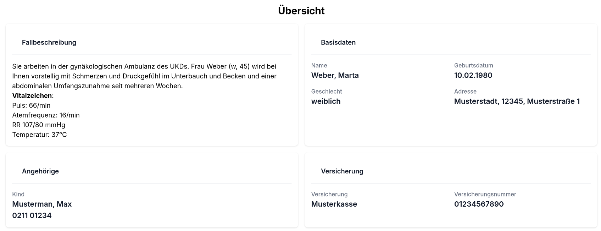

# 5.1 How to Create a New Case  

### 1. Add a case to `CaseTemplates`

Add a JSON case to [`CaseTemplates`](../Database_Structure/3_2_2_case_templates.md).
  - Assign a new `case_id`.
  - Choose the type of your case (dynamic/static). An overview of the differences can be found [here](../Database_Structure/3_2_2_case_templates.md).
  - Define age, gender, labs, vitals, history, findings and cardinal_symptoms.

### 2. Add a `vignette` (*optional*)

A `vignette` is a brief description of the case, which will appear on the landing page. you an add the `vignette` to the JSON case in `CaseTemplates` as you added the age, history etc. 
In the following you can see an axample:

```json
{
  "vignette": "Sie arbeiten in der gynäkologischen Ambulanz des UKDs. Frau $name_last ($gender, $age) wird bei Ihnen vorstellig mit Schmerzen und Druckgefühl im Unterbauch und Becken und einer abdominalen Umfangszunahme seit mehreren Wochen.\n\n **Vitalzeichen**: \n\n Puls: $vitals.values.heart_rate/min \n\n Atemfrequenz: $vitals.values.respiratory_rate/min \n\n RR $vitals.values.blood_pressure_systolic/$vitals.values.blood_pressure_diastolic mmHg \n\n Temperatur: $vitals.values.temperature°C"
}
```

In Clinic Edge it will look like this:



You can also add a `vignette_patient`, for example:

```json
{
  "vignette_patient": "Sie sind Frau $name_last, $age Jahre alt und haben Schmerzen und ein Druckgefühl im Unterbauch. Ihr Bauchumfang hat seit mehreren Wochen zugenommen. "
}
```

This information will be used by the Chatbot, which acts as the patient in the anamnesis chat.

### 3. Add vars_path entries

Add or reuse vars_path entries in [`FindingsTemplate`](../Database_Structure/3_2_3_findings_template.md). Ensure to add case-specific findings to vars_path of all applicable examinations in `FindingsTemplate`.

### 4. Add normal findings and lab values

Extend `normalfindings_collection.json` and `labvalues.json` if necessary.