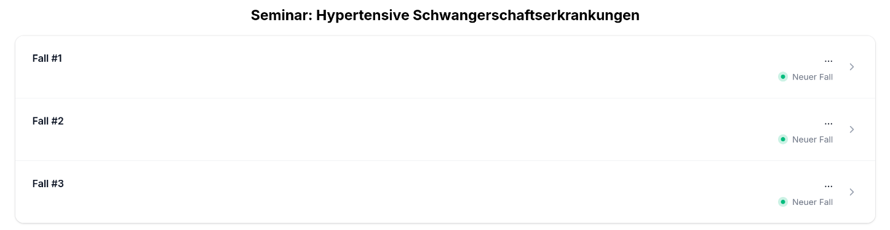
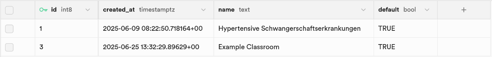
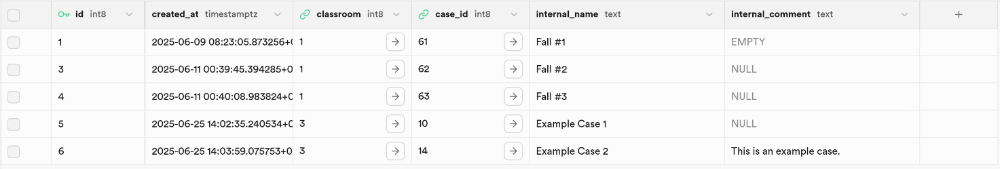
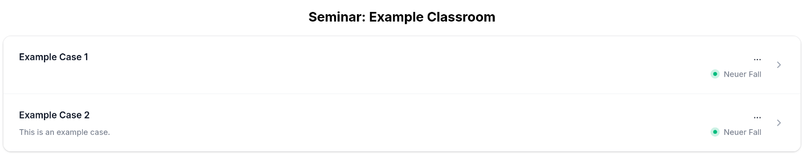

# 5.4 How to Create a Classroom

Besides creating individual cases, Clinic Edge offers the functionality to create classrooms. A classroom can be used to group several existing cases, that you want to use for your upcoming seminar. This way, it is more manageable for your students to find the specific cases, they need to work on. You can see in the graphic below, how a classroom is depicted in the case overview in Clinic Edge.

### 1. Add cases to `CaseTemplates`

- If they do not already exist, add your desired cases to `CaseTemplates` as described [here](./5_1_tutorial_case.md). 
- Note the `case_id` of the cases, you would like to use. The IDs will be needed it to assign the cases to your classroom.

### 2. Add a Classroom to the Database

- Add a new row in the table `classrooms` in Supabase.
- Assign a name and set `default` to `TRUE`.
- The ID will automatically be generated.

The table entry should look like this:

Your classroom should now appear in the case overview in Clinic Edge.

:::tip
If you don't want your classroom to be listed in the case overview anymore, you can set `default` to `FALSE`. 
:::

### 3. Assign Cases to the Classroom

- Add a new row in the table `classroom_cases` for each case you want to add to your classroom.
- Insert the ID of your classroom in the column `classroom`. You can find the ID in the first column of the `classrooms` table.
- Add the `case_id` of the case, you want to assign to the classroom.
- Assign a name to the case. You can take the name from `CaseTemplates` or assign a new name (e.g., if you want to hide the diagnosis).
- *Optional*: Add a description of the case to `internal_comment`, if you like. The case description will be shown below the name in the case overview in Clinic Edge.

In the following graphic, some examples of table entries are shown:

### 4. Open Clinic Edge

To check, if your classroom was succesfully added, open Clinic Edge and search for your classroom in the case overview. In the graphic below, you can see our example classroom.

